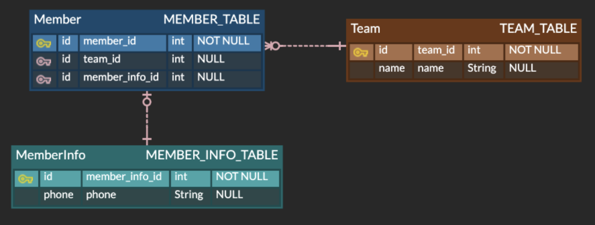
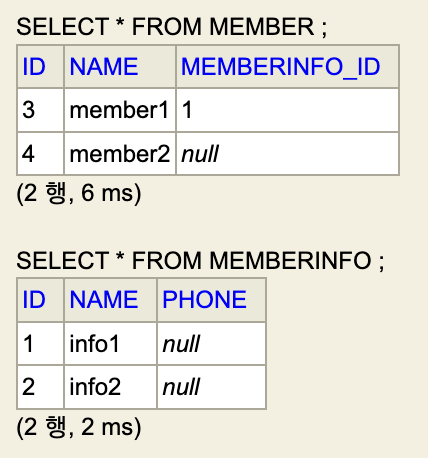

# 1. 객체와 테이블의 괴리

ORM 은 결국 DB 테이블을 객체로 구성해 편하게 개발하기 위한 이념이다.

그런데 여기서 "정말 테이블을 그대로 객체로 구성할 수 있을까?" 라는 의문이 들 수 있다.

다음 상황을 생각해보자.

<!-- obj-vs-table-1.png -->

<p align="center">
    
</p>

`Team - Member` 는 `1:N`, `Member - MemberInfo` 는 `1:1` 인 비식별 관계이다.
(어느 한 Member 는 Team 에 속하지 않을 수 있고, Info 가 없을수도 있다.)

여기서 `Member - Team` 관계에 주목해보자. `MEMBER_TABLE` 은 `team_id` 컬럼을 FK 로 `TEAM_TABLE` 을 참조하고 있는 반면, `TEAM_TABLE` 에는 `MEMBER_TABLE` 을 관계시켜주는 속성이 없다.

즉, <span style="color:#7898FB">**`Member - Team` 관계를 엮어주는 존재는 `MEMBER_TABLE` 에만 1개 존재한다.**</span>

반면 이와 유사한 관계를 _"객체지향적"_ 으로 나타내보면 다음과 같다.

```java
class Left {
    Right R;
}
class Right {
    Left L;
}
```

`Left -> Right` 로 참조하기 위해선 `Left.R` 필드가 반드시 필요하고, `Right -> Left` 시 `Right.L` 필드가 존재해야 한다.
ㅇ
이를 테이블의 예시와 비교해보자. 
`Member <---> Team` 시 필요한 _"정보"_ 는 `MEMBER_TABLE` 의 `team_id` **오직 하나** 였다.
하지만 `Left <---> Right` 시 필요한 _"정보"_ 는 `Left.R`, `Right.L` **2 개** 였다.

즉, 어느 두 존재를 연관시킬 때, <span style="color:#7898FB">**DB 세상에서는 _"관계시키는 존재"_ 는 하나만**</span> 필요하지만 <span style="color:#7898FB">**객체세상에서는 _"관계시키는 존재"_ 가 두개나**</span> 필요한 것이다!

이러한 사실 때문에 DB 세상과 ORM 세상은 약간의 괴리가 존재하고, **이를 바탕으로 DB, 엔티티를 설계해야 한다.**

---

# 2. 연관관계의 주인

앞서 `Member - Team` 관계를 통해 ORM 세상은 DB 와 조금 다른 것을 인지하였다.

이번에는 `Member - MemberInfo` 관계를 오직 _"객체지향적"_ 으로 나타내보자.

```java
// 양방향 참조 케이스   :   Member <----> MemberInfo 가능
class Member {
    // Team T; (생략)
    MemberInfo info;
}
class MemberInfo {
    Member member;
    String phone;
}
```

우리는 이전 ERD 를 이미 보았기 때문에 **`MEMBER_TABLE` 에 FK `member_info_id` 가 존재하고 `MemberInfo` 가 `Member` 에 _"종속적"_** 임을 알고 있다.

하지만 <span style="color:#7898FB">**그 사실을 위 클래스 관계만을 통해 알 수 있는가?**</span>

그렇다면 아래 _"단방향 참조"_ 에서는 어떤가?

```java
// 단방향 참조 케이스   :   Member --> MemberInfo 만 가능
class Member {
    // Team T; (생략)
    MemberInfo info;
}
class MemberInfo {
    // Member member; (없어짐)
    String phone;
}
```

여기서 중요한 사실을 깨달을 수 있다.
**단방향 참조에서는 두 엔티티간 종속관계가 명확하지만, 양방향 참조에서는 알 수 없다** 는 것이다.

즉, 실 DB 테이블 연관관계를 <span style="color:#7898FB">**_"양방향 참조 엔티티"_ 로 구체화할 때, ORM 이 "제대로 동작하기 위해서" 는 엔티티간 _"종속관계 정보"_ 가 필요**</span> 하다는 것이다!

이러한 개념을 토대로 만들어진 것이 **_연관관계의 주인_** 이다.

JPA 는 <span style="color:#7898FB">두 엔티티가 양방향으로 참조할 때 **둘 중 하나는 반드시 연관관계의 주인 (Owner)** 이어야 한다고 명시하며, **오직 주인을 통해서만 해당 연관관계를 수정 (update) 할 수 있다**</span> 말한다. [`[1]`](#reference)

잠깐 앞선 내용이지만 아래 예시를 보자.

```java
@Entity
class Member {

    @Id @GeneratedValue
    private Long id;
    private String name;    // 편의상 별도 컬럼 추가 & 생성자 생략
  
    @OneToOne
    @JoinColumn(foreignKey = @ForeignKey(name = "FK__MEMBER_INFO_ID"))
    public MemberInfo memberInfo;
    // 예시 쉽게 하려고 public 으로 설정함.
}


@Entity
class MemberInfo {

    @Id @GeneratedValue
    private Long id;
    private String name;    // 편의상 별도 컬럼 추가 & 생성자 생략
    private String phone;

    @OneToOne(mappedBy = "memberInfo")
    public Member member;
    // 예시 쉽게 하려고 public 으로 설정함.
}
```

위 코드는 `Member - MemberInfo` 관계가 양방향 참조관계이며, **관계의 주인이 `Member` 임을 나타내고 있다.** 
(이후의 내용이지만 `mappedBy` 를 통해 관계의 주인을 지정할 수 있다.)

때문에 **JPA 는 `Member` 엔티티가 주인임을 인지해, `MEMBER_TABLE` 에 `MEMBER_INFO_TABLE` FK 제약조건을 생성** 한다.

(+ 위 `Member` 엔티티에 `@JoinColumn` 이 없어도 되는데 그러면 FK 제약조건 이름이 랜덤하게 생성되서 이쁘게 보일라고 추가했다.)

```
# Member 테이블에 memberInfo_id 컬럼을 포함시켜 생성한다.
Hibernate: 
    create table Member (
       id bigint not null,
        memberInfo_id bigint,   # <-- 여기
        primary key (id)
    )
Hibernate: 
    create table MemberInfo (
       id bigint not null,
        phone varchar(255),
        primary key (id)
    )

# Member 테이블에 FK 를 설정하고 있다.
Hibernate: 
    alter table Member
       add constraint FK__MEMBER_INFO_ID 
       foreign key (memberInfo_id) 
       references MemberInfo
```

여기서 아래와 같은 코드를 실행해보자.

```java
EntityManager em = openEmfAndGetEm();   // 코드 생략
em.getTransaction().begin();            // 트랜잭션 시작

MemberInfo info1 = new MemberInfo("info1");
MemberInfo info2 = new MemberInfo("info1");

Member member1 = new Member("member1");
Member member2 = new Member("member2");

persist(em, info1, info2, member1, member2);    // 코드 생략
em.flush();

System.out.println("==================================");

// Member 를 통해 Member - Info 연관관계 생성
member1.memberInfo = info1;

// Info 를 통해 Member - Info 연관관계 생성
info2.member = member2;

em.getTransaction().commit();           // 트랜잭션 커밋
System.out.println("==================================");

closeEmAndEmf();
```

코드를 보면 기본적으로 `member1, 2`, `info1, 2` 엔티티를 바로 DB 에 반영하고, `member1 <----> info1`, `member2 <----> info2` 연관관계를 맺어주고 있다.

하지만 실제 쿼리를 보면 `Member <----> MemberInfo` 연관관계 설정이 오직 1 개만 설정되는 것을 볼 수 있고, DB 를 들여다보면 **`member1 <----> info1` 관계만 update** 된 것을 볼 수 있다.

```
# ... INSERT 쿼리 생략 ...
==================================
Hibernate: 
    /* update
        scripts.entities.Member */ update
            Member 
        set
            memberInfo_id=?,
            name=? 
        where
            id=?
==================================
```

<!-- owner-of-relation-1.png -->

<p align="center">
  
</p>

즉, <span style="color:#7898FB">**양방향 연관관계의 주인을 통해서만 관계를 수정할 수 있는 것이다!**</span>

우리는 `Member`, `MemberInfo` 를 양방향 참조 관계를 설정하였고, (`mappedBy` 속성을 통해) `Member` 가 관계의 주인임을 명시하였다.

때문에 <span style="color:#7898FB">`Member - MemberInfo` **양방향 관계는 주인 `(Member)` 를 통해서만 `(member.info = ... )` 수정할 수 있으며, "하인" `(Info)` 은 주인을 "읽을" 수만 있다.**</span> 

---

# 3. 단방향 연관관계 VS 양방향 연관관계

앞선 설명을 한번 정리해보자. 
DB 세상을 그대로 ORM 세상으로 끌어내리기에는 약간의 괴리가 존재한다. 테이블에서와 객체에서 **"양방향 참조"** 가 이뤄지는 방식이 조금 다르기 때문이다.

이로인해 JPA 는 **"연관관계의 주인"** 이라는 개념을 소개하며, 양방향 관계는 오직 주인을 통해서만 수정할 수 있다 말한다.

그럼 여기서 한가지 의문이 들 수 있다. **"연관관계의 주인"** 은 **"양방향 참조"** 를 ORM, DB 두 세상 모두에 적용시키고자 존재하는 개념이다.

그런데 그럼 **"단방향 참조"** 의 경우에는 어떨까? 단방향 참조에서는 "관계의 주인" 이 필요할까?

```java
// 단방향 참조 케이스   :   Member --> MemberInfo 만 가능
class Member {
    // Team T; (생략)
    MemberInfo info;
}
class MemberInfo {
    // Member member; (없어짐)
    String phone;
}
```

그렇다! 단방향에서는 크게 고민할 필요가 없다. 애초에 참조를 갖고 있는 자기 자신이 주인이기 때문이다!

우리가 위 클래스 관계만으로 DB 테이블 구조를 유추할 수 있듯, ORM 또한 FK 를 어느 테이블에 생성할지 쉽게 판단한다.

즉, <span style="color:#7898FB">양방향 연관관계보다 **단방향 연관관계의 시스템 복잡도가 낮다**는 것이고, 우리 **필요에 맞춰 양방향 연관관계를 설립** 하자는 것이다.</span> 

때문에 강의, 여러 reference 에서도 먼저 단방향 연관관계를 수립하고, 정말 진짜로 필요할 때만 양방향 연관관계를 추가하라 조언한다.

---

## Reference

- [Hibernate Community Documentation - 2.2.5.1. One-to-one](https://docs.jboss.org/hibernate/annotations/3.5/reference/en/html_single/#entity-mapping-association)
    - `[1]` : The association may be bidirectional. In a bidirectional relationship, one of the sides (and only one) has to be the owner: the owner is responsible for the association column(s) update. 

---
