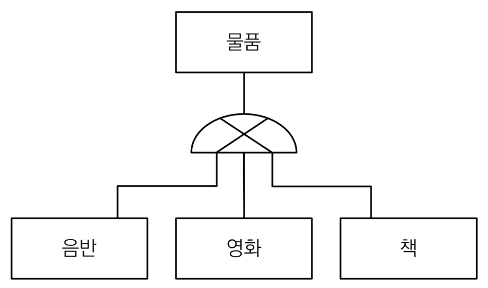
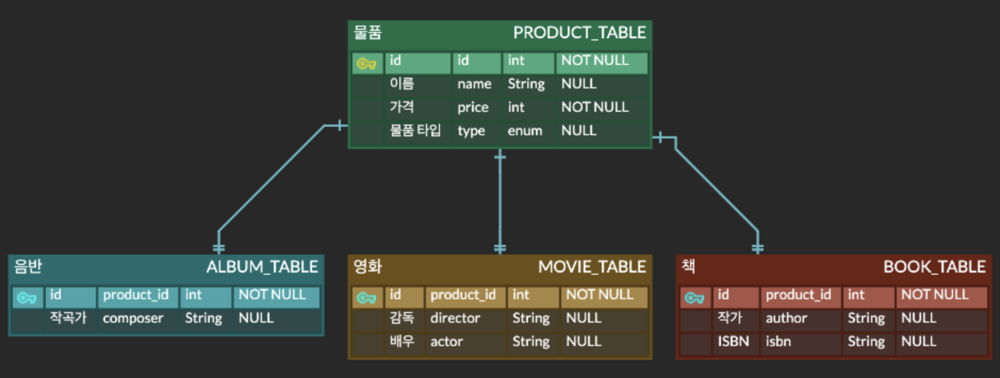
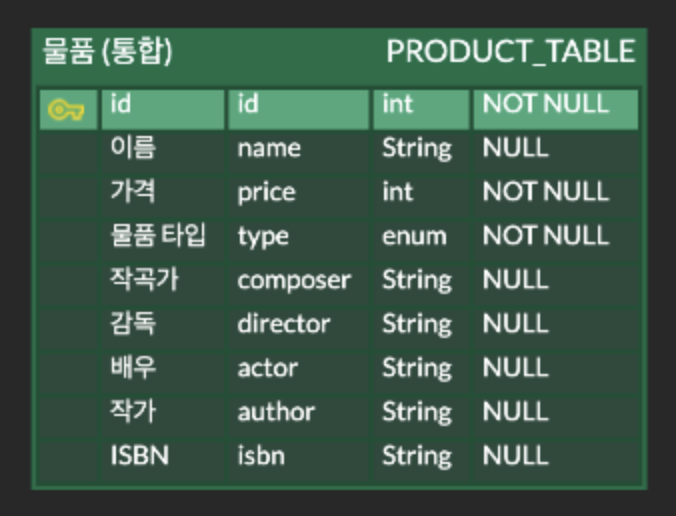
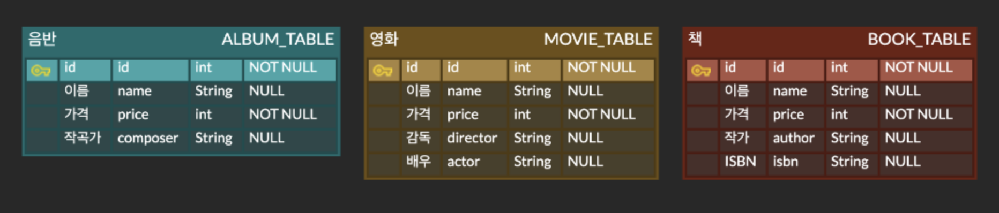
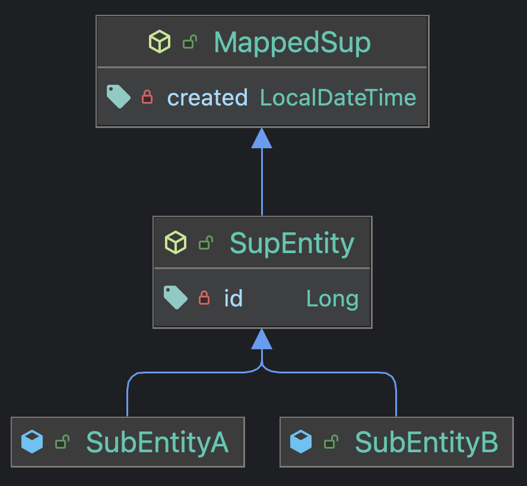
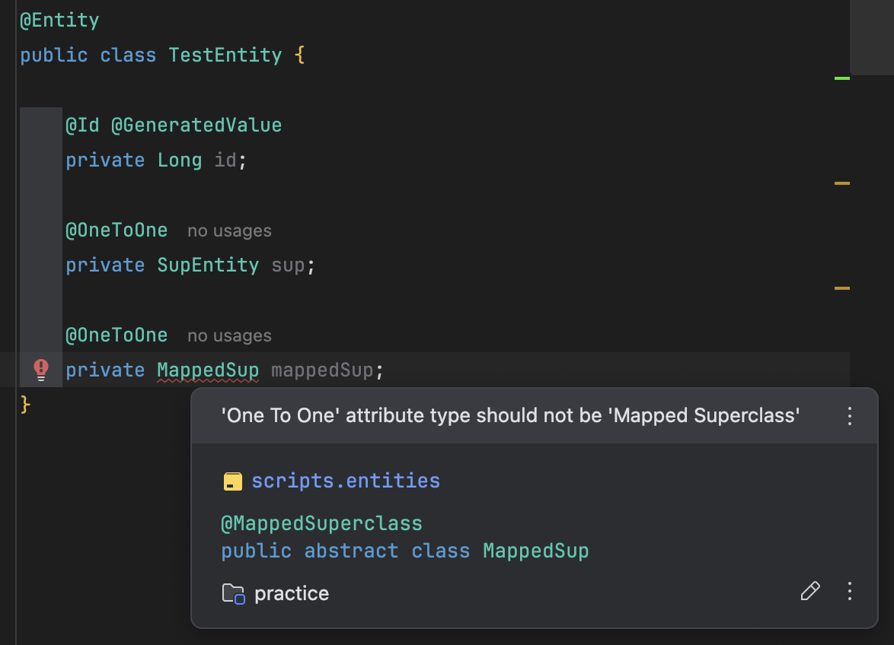

# 1. DB 세상에서의 상속

DB 에 저장하는 정보는 결국 현실의 요구를 바탕으로 선택되어 저장된다.

때문에 종종 DB 에 저장되는 정보가 현실에선 논리적 상-하 관계를 가질 때가 존재한다.

<!-- inheritance-1.png -->

<p align="center">
    
</p>

하지만 알다시피 DB 에는 "상속" 이라는 개념이 없고, 오직 테이블과 그들의 제약 조건만 존재한다.
때문에 위처럼 "논리적 상속" 관계를 DB 세상에 녹여낼 때, 다음 3 가지 전략 중 하나를 선택해 사용한다.

|                                             JOIN 전략                                             |                                                   통합 테이블 전략                                                   |                                                  개별 테이블 전략                                                  |
|:-----------------------------------------------------------------------------------------------:|:-------------------------------------------------------------------------------------------------------------:|:-----------------------------------------------------------------------------------------------------------:|
|  |  |  |

- **JOIN 전략 & 통합 테이블 전략**

    위 그림을 보면 `JOIN`, `통합` 전략에 모두 <span style="color:#7898FB">**`type` column 이 존재하고, 이를 이용해 물품의 세부 타입 (음반, 영화, 책) 을 구분해 사용**</span> 한다.
    **`JOIN`** 은 그 타입을 통해 `물품 - 세부 물품` 을 join 해 사용하는 전략으로, **세 전략 중 가장 정규화된 전략** 이라 볼 수 있다.
    반면 **`통합` 전략** 은 `세부 물품` 에 필요한 모든 column 을 통합해 하나의 테이블로 저장하는 전략이다.
    때문에 **조회 속도가 가장 빠를 수 있지만 테이블 내 NULL 이 상당수 차지할 수 있는 단점** 이 존재한다.

- **개별 테이블 전략**

    `개별` 전략의 그림을 보면 이전 전략들과 달리 **`type` 같은 column 이 없는** 것을 볼 수 있다.
    즉, `개별` 전략에서 테이블간 "상속" 관계는 정말 "논리상으로만 존재" 하는 것이고, 실 DB 구성에서는 찾아볼 수 없다. 
    그나마 장점이라 하면 테이블이 서로 독립적이기 때문에 각기 다른 제약조건을 적용할 수 있고 책임과 역할이 더욱 분명해 질 수 있다는 점이다. (그런데 제약조건이라면 그렇다 쳐도 책임과 역할은 DB 세상에서 별로 중요하지 않을까 싶다.)

---

# 2. `@Inheritance` : DB 의 상속 전략을 명시

앞서 "논리적 상속" 관계가 DB 에 어떻게 구성되 사용되는지 알아보았다.

그럼 이 "논리적 상속" 을 ORM 세상에서는 어떻게 녹여야 할까? 
당연히 ORM 세상에는 상속이 있으므로, 이를 통한 **다형성을 이용할 수 있어야 한다.**

즉, 실 DB 구성이 어떤지는 몰라도, 아래처럼 **다형성을 이용할 수 있어야 ORM 에 "논리적 상속" 이 잘 녹아들었다는 것이다.**

```java
class Product {/* ... */}
class Album extends Product {/* ... */}

// 다형성의 관점으로 보면 아래 코드가 우리 의도대로 잘 작동해야 한다.
// DB "상속 전략" 이 어떤것이든 잘 작동해야 한다.
Product album = new Album();
em.persist(album);
```

그럼 JPA 는 어떻게 DB 의 논리적 상속관계를 ORM 세상으로 구체화하는 것일까?
바로 `@Inheritance` 이다.

```java
@Entity
@Inheritance
class Product {
    /* id */
}

@Entity
class SubProduct extends Product {
    /* 세부 물품별 필요한 column 들 */
}
```

<span style="color:#7898FB">**`@Inheritance` 를 통해 엔티티간 상속을 유지하면서 실 DB 상속관계 전략을 명시할 수 있다.**</span>

이 때 주의할 점은 `Product`, `SubProduct` 모두 `@Entity` 어노테이션을 붙여야 한다.

아래 코드는 실제 `@Inheritance` 과 `InheritanceType` 의 구현 코드이다.

```java
/**
 * Specifies the inheritance strategy to be used for an entity class
 * hierarchy. It is specified on the entity class that is the root of
 * the entity class hierarchy.  If the <code>Inheritance</code> annotation is not
 * specified or if no inheritance type is specified for an entity
 * class hierarchy, the <code>SINGLE_TABLE</code> mapping strategy is used.
 */
@Target({TYPE})
@Retention(RUNTIME)
@interface Inheritance {

    /** The strategy to be used for the entity inheritance hierarchy. */
    InheritanceType strategy() default SINGLE_TABLE;
}

/**
 * Defines inheritance strategy options.
 *
 * @since Java Persistence 1.0
 */
enum InheritanceType {

  /** A single table per class hierarchy. */
  SINGLE_TABLE,

  /** A table per concrete entity class. */
  TABLE_PER_CLASS,

  /**
   * A strategy in which fields that are specific to a 
   * subclass are mapped to a separate table than the fields 
   * that are common to the parent class, and a join is 
   * performed to instantiate the subclass.
   */
  JOINED
}
```

주석에 나와있듯 `@Inheritance(strategy = ...)` 와 같이 DB 상속 전략을 명시하고, 생략시 `SINGLE_TABLE` 전략이 기본임을 알 수 있다.

`InheritanceType` 는 `JOINED`, `SINGLE_TABLE`, `TABLE_PER_CLASS` 가 있으며, 이들은 앞서 [1. DB 세상에서의 상속](#1-db-세상에서의-상속) 에 설명한 `JOIN`, `통합`, `개별` 전략들과 동일하다.

사실 이 `InheritanceType` 만 잘 생각해 `strategy` 만 명시하면 JPA 가 알아서 맵핑해 주므로 크게 어렵지 않다.

---

# 3. `JOIN` & `통합 테이블` 전략으로 맵핑하기

자 그럼 각 전략들을 실제로 어떻게 사용하는지 알아보자. 
이전 [1. DB 세상에서의 상속](#1-db-세상에서의-상속) 에서 `JOIN`, `통합 테이블` 전략에는 `type` column 을 이용해 세부 타입을 구분함을 인지하였다.

때문에 JPA 에서도 이 `type` 과 관련된 어노테이션이 있는데, 바로 `@DiscriminatorColumn`, `@DiscriminatorValue` 어노테이션이다.

```java
// 시험삼아 JOIN 전략 이용
@Entity
@Inheritance(strategy = InheritanceType.JOINED)
@DiscriminatorColumn(name = "PRODUCT_TYPE")
class Product {
    
    @Id @GeneratedValue
    private Long id;
}

@Entity
@DiscriminatorValue(value = "SUB_PRODUCT")
class SubProduct extends Product { }

// 실제 DB 에 SubProduct 를 저장
// 트랜잭션 생성, 커밋 생략
em.persist(new SubProduct())
```

```
// create & apply constraint
Hibernate: 
    create table Product (
       PRODUCT_TYPE varchar(31) not null,
        id bigint not null,
        primary key (id)
    )
Hibernate: 
    create table SubProduct (
       id bigint not null,
        primary key (id)
    )
Hibernate: 
    alter table SubProduct 
       add constraint FK54v2rx3bqdr592t0mp8nv32xf 
       foreign key (id) 
       references Product

...

// insert
Hibernate: 
    /* insert scripts.entities.SubProduct
        */ insert 
        into
            Product
            (PRODUCT_TYPE, id) 
        values
            ('SUB_PRODUCT', ?)
Hibernate: 
    /* insert scripts.entities.SubProduct
        */ insert 
        into
            SubProduct
            (id) 
        values
            (?)
```

_Discriminator_ 를 영문 해석하면 _판별자_ 로, **`@Discriminator~` 를 통해 세부 타입의 _"판별명"_, `type` column 의 이름과 그 값을 무엇으로 구성할지 명시할 수 있다.**

<span style="color:#7898FB">**`@DiscriminatorColumn` 는 부모 엔티티에 붙여 `type` column 명을 설정**</span> 한다. 만약 생략되었을 시 `DTYPE` 이라는 column 으로 설정된다.

<span style="color:#7898FB">**`@DiscriminatorValue` 는 그 `type` column 에 저장될 값을 명시**</span> 하는 역할로, <span style="color:#7898FB">**자식 엔티티에 붙여 자식마다 어떤 값이 저장될지 설정**</span> 한다.

때문에 위 DDL, INSERT 쿼리를 보면 `Product` 테이블에 `PRODUCT_TYPE` column 이 생성되고, `SUB_PRODUCT` 이라는 값으로 row 가 생성되는 것을 볼 수 있다.

더불어 `SINGLE_TABLE` 전략을 이용하면 당연히 통합 테이블로 생성되 저장된다.

```java
@Entity
@Inheritance(strategy = InheritanceType.JOINED)
@DiscriminatorColumn(name = "PRODUCT_TYPE")
class Product {
    /* ... */
}

/* ... SubProduct, 엔티티 저장 코드 생략 */
```

```
// create
Hibernate: 
    create table Product (
       PRODUCT_TYPE varchar(31) not null,
        id bigint not null,
        primary key (id)
    )

... 

// insert
Hibernate: 
    /* insert scripts.entities.SubProduct
        */ insert 
        into
            Product
            (PRODUCT_TYPE, id) 
        values
            ('SUB_PRODUCT', ?)
```

<span style="color:#7898FB">**이 때 만약 부모 엔티티에 `@DiscriminatorColumn` 을 생략하면 `type` column 이 생성되지 않음에 유의하자.**</span>

물론 애초에 `Product - SubProduct` 가 식별관계여서 성능에 큰 차이는 없지만, 나중에 DB 데이터를 직접 볼 때 조금 불편할 수 있다.  

---

# 4. 개별 테이블 전략으로 맵핑하기

다음은 `개별 테이블` 전략을 사용하는 방법이다.

사실 이 전략은 그다지 좋지 못한 전략인데, 애초에 개별 테이블로 나눠 사용해야 하는 상황이면 각기 다른 엔티티로 관리하는게 더 올바르기 때문이다.

아무튼 사용 방법은 아주 간단하다.

```java
@Entity
@Inheritance(strategy = InheritanceType.TABLE_PER_CLASS)
class Product {
    
    @Id @GeneratedValue
    private Long id;
}

@Entity
class SubProduct extends Product { }

// 실제 DB 에 SubProduct 를 저장
// 트랜잭션 생성, 커밋 생략
em.persist(new SubProduct())
```

```
// create
Hibernate: 
    create table Product (
       id bigint not null,
        primary key (id)
    )
Hibernate: 
    create table SubProduct (
       id bigint not null,
        primary key (id)
    )

...

// insert
Hibernate: 
    /* insert scripts.entities.SubProduct
        */ insert 
        into
            SubProduct
            (id) 
        values
            (?)
```

딱히 특별한 점은 없지만 한가지 주의해야 할 점이 존재하는데, <span style="color:#7898FB">**`개별 테이블` 전략은 `@GeneratedValue(strategy = GenerationType.IDENTITY)` 과 사용할 수 없다는 점이다.**</span>

이는 생각해 보면 아주 당연하다. 
IDENTITY 전략을 쉽게 치환하면 AUTO_INCREMENT 이고, **이 increment 는 테이블마다 다르기 때문** 이다.

아래 코드를 생각해보자.

```java
Product a = new SubProductTypeA();
Product b = new SubProductTypeA();
em.persist(a);
em.persist(b);
em.flush();

Product find = em.find(Product.class, 1L);  // <---- 뭐가 나올까? 애초에 뭐가 나올 수 있을까??
```

자식 엔티티가 여러개이고, 몇개의 샘플을 저장했다 하자. 그 이후 **`em.find(Product.class, 1L)` 를 실행했을 때, 무엇이 나올지 예상이 되는가?**

그렇다. 전혀 알 수 없는것이다.
AUTO_INCREMENT 로 인해 `SubProductTypeA`, `SubProductTypeB` 두 테이블에 모두 `1L` PK 를 가진 row 가 생성되었기 때문에 알 수 없다.

그럼 위 상황을 한번 ORM 의 입장에서 생각해보자.
앞서 [2. `@Inheritance` : DB 의 상속 전략을 명시](#2-inheritance--db-의-상속-전략을-명시) 에서 **다형성을 이용할 수 있어야 ORM 에 논리적 상속이 잘 녹아들었다** 고 설명했다.

하지만 위 상황은 다형성이 이뤄지지도 않고 객체지향적으로도 성립하지 않는다.
그래서 실제 `TABLE_PER_CLASS` 를 IDENTITY 전략과 같이 사용하면 아래와 같은 에러가 발생해 run 에 실패한다.

```
Exception in thread "main" javax.persistence.PersistenceException: [PersistenceUnit: MySQL] Unable to build Hibernate SessionFactory
	at org.hibernate.jpa.boot.internal.EntityManagerFactoryBuilderImpl.persistenceException(EntityManagerFactoryBuilderImpl.java:1597)
	...
Caused by: org.hibernate.MappingException: Cannot use identity column key generation with <union-subclass> mapping for: scripts.entities.Product
	at org.hibernate.persister.entity.UnionSubclassEntityPersister.<init>(UnionSubclassEntityPersister.java:82)
	...
```

---

# 5. Abstract VS Concrete : 부모의 독립성

지금까지 DB 세상에서의 상속 방법 3 가지를 ORM 세상으로 구성하는 방법을 알아보았다.

그런데 인터넷에 이와 관련된 내용을 검색해 보면 종종 아래처럼 부모 엔티티를 abstract class 로 만든 예시를 볼 수 있다.

```java
@Entity
@Inheritance(strategy = InheritanceType.JOINED)
@DiscriminatorColumn
abstract class Product {
    
    @Id @GeneratedValue
    private Long id;
}

@Entity
class SubProduct extends Product { }
```

이는 abstract class 의 특징을 생각하면 어떤 의도인지 쉽게 알 수 있다.

만약 `Product` 가 구현체였다면 `Product p = new Product();` 처럼 직접 생성할 수 있다.
하지만 abstract class 는 그러지 못하고 `Product p = new SubProduct();` 처럼 다형성으로만 사용할 수 있다.

그럼 이게 무엇을 의미하는가?
바로 <span style="color:#7898FB">**부모 엔티티가 독립적으로 저장될 수 있는지를 나타낸다.**</span> 아래 또다른 예시를 보자.

```java
@Entity
@Inheritance(strategy = InheritanceType.SINGLE_TABLE)
@DiscriminatorColumn
public abstract class Abstract {
    /* ... id 생략 ... */
}
@Entity
public class SubAbstract extends Abstract { }

@Entity
@Inheritance(strategy = InheritanceType.SINGLE_TABLE)
@DiscriminatorColumn
public class Concrete {
    /* ... id 생략 ... */
}
@Entity
public class SubConcrete extends Concrete { }

// 실제 DB 에 SubProduct 를 저장
// 트랜잭션 생성, 커밋 생략
em.persist(new SubAbstract());
em.persist(new Concrete());
em.persist(new SubConcrete());
```

```
// create
Hibernate: 
    create table Abstract (
       DTYPE varchar(31) not null,
        id bigint not null,
        primary key (id)
    )
Hibernate: 
    create table Concrete (
       DTYPE varchar(31) not null,
        id bigint not null,
        primary key (id)
    )

...

// insert
Hibernate: 
    /* insert scripts.entities.SubAbstract
        */ insert 
        into
            Abstract
            (DTYPE, id) 
        values
            ('SubAbstract', ?)
Hibernate: 
    /* insert scripts.entities.Concrete
        */ insert 
        into
            Concrete
            (DTYPE, id) 
        values
            ('Concrete', ?)     // <-- Concrete 부모 엔티티가 저장됨
Hibernate: 
    /* insert scripts.entities.SubConcrete
        */ insert 
        into
            Concrete
            (DTYPE, id) 
        values
            ('SubConcrete', ?)
```

위 DDL 과 INSERT 쿼리를 [3. `JOIN` & `통합 테이블` 전략으로 맵핑하기](#3-join--통합-테이블-전략으로-맵핑하기) 의 `SINGLE_TABLE` 의 것과 비교하면 다른 점이 없다.

즉, DB 입장에서는 아무것도 변한게 없다.
하지만 이를 객체 입장에서 생각해보면 조금 이야기가 달라진다. 애초에 `new Abstract();` 를 할 수 없으니 `Abstract` 엔티티가 생성되지도 않고 JPA 로 영속할 수 없기 때문이다.

따라서 만약 <span style="color:#7898FB">**"자식 엔티티들과 구분된, 독립적인 엔티티가 필요" 하다면 구현체를, "독립적인 부모 엔티티가 필요 없다" 면 추상 클래스를**</span> 사용하는 것이 바람직하다.

---

# 6. `@MappedSuperclass` : 필드와 기능을 상속

DB 세상에서 "상속" 은 테이블간 논리적 상-하 관계를 뜻하고, 때문에 우리는 지금껏 `@Inheritance` 와 엔티티간 상속을 통해 이를 구성하였다.

하지만 객체 세상에서 상속은 오직 논리적 상-하 관계만을 위해 존재하지 않는다. 
다음처럼 어느 기능을 이어받거나 필드를 이어받기 위해서도 사용된다.

```java
abstract class Sup {
    
    protected int value;
    
    public void doSomething() {
        System.out.println("SOMETHING");
    }
    
    public void showValue()    {
        System.out.println(value);
    }
}

class Sub extends Sup {
    private int otherValue;
    
    public void showOtherValue()    {
        System.out.println(otherValue);
    }
}

Sub sub =  new Sub();
sub.doSomething();
sub.showValue();
sub.showOtherValue();
```

만약 이어받을 기능 혹은 필드가 DB 와 전혀 관계없는 "객체 세상만의 것" 이라면 아래처럼 쉽게 만들 수 있다.

```java
@Entity
class TestEntity extends Sup {
    /* id 생략 */
}
```

하지만 그렇지 않다면? DB 테이블의 공통된 필드, 관련된 기능을 객체에서 상속시키고 싶다면?
이를 위한 존재가 바로 `@MappedSuperclass` 어노테이션이다.

```java
@MappedSuperclass
abstract class CreateModified {
    
    @CreationTimestamp
    public LocalDateTime created;
  
    @UpdateTimestamp
    public LocalDateTime modified;

    public Duration duration() {
      return Duration.between(created, modified);
    }
}

@Entity
class EntityA extends CreateModified {/* ... */}
@Entity
class EntityB extends CreateModified {/* ... */}
```

```
Hibernate: 
    create table EntityA (
       id bigint not null,
        created timestamp,
        modified timestamp,
        primary key (id)
    )
Hibernate: 
    create table EntityB (
       id bigint not null,
        created timestamp,
        modified timestamp,
        primary key (id)
    )
```

DDL 을 보면 `EntityA`, `EntityB` 테이블 모두 `created`, `modified` column 이 생성되는 것을 볼 수 있으며, 상속으로 인해 `A`, `B` 모두 `#.duration()` 메서드를 사용할 수 있게 되었다.

이 때 반드시 주의할 점은 <span style="color:#7898FB">**`@MappedSuperclass` 클래스는 엔티티가 될 수 없다는 점이다.**</span>
실제로 `@MappedSuperclass` 와 `@Entity` 어노테이션을 동시에 사용하면 아래와 같은 에러가 발생한다. (자세한 내용은 후술)

```
Exception in thread "main" org.hibernate.AnnotationException: An entity cannot be annotated with both @Entity and @MappedSuperclass: scripts.entities.CreateModified
	at org.hibernate.cfg.AnnotationBinder.bindClass(AnnotationBinder.java:522)
	...
```

더불어 `@MappedSuperclass` 클래스는 반드시 abstract 일 필요는 없지만, 애초에 "해당 엔티티들에게 종속적인 필드" 를 포함하므로 abstract 하게 만들어 해당 클래스 생성을 제한하는게 좋아 보인다.

(+ `@CreationTimestamp`, `@UpdateTimestamp` 는 모두 Hibernate 어노테이션들이다.)

---

# 7. `@Inheritance` VS `@MappedSuperclass`

JPA 로 개발을 하다 보면 `@Inheritance` 와 `@MappedSuperclass` 가 어떤 차이가 있는지 의문이 들 수 있다.

실제로 어떤 상황에서는 두 방법이 동일한 DB 구조를 구성하기 때문이다.
하지만 <span style="color:#7898FB">**이 둘은 전혀 다르며 의문이 들 수록 JPA 에서 엔티티가 무엇을 의미하는지 돌아봐야 한다.**</span>

다음 예시를 보자.

```java
@MappedSuperclass
public abstract class MappedSup {

    @CreationTimestamp
    private LocalDateTime created;
}

@Entity
@Inheritance
public abstract class SupEntity extends MappedSup {

  @Id @GeneratedValue
  private Long id;
}

@Entity
public class SubEntityA extends SupEntity { }
@Entity
public class SubEntityB extends SupEntity { }
```

<!-- inheritance-vs-mappedsuperclass-1.png -->

<p align="center">
  
</p>


위 예시를 조금 설명하자면 `SubEntityA`, `SubEntityB` 는 `SINGLE_TABLE` 전략으로 `SupEntity` 에 속하며, `created` column 이 상속된다.

```
Hibernate: 
    create table SupEntity (
       DTYPE varchar(31) not null,
        id bigint not null,
        created timestamp,
        primary key (id)
    )
```

위 상황에서 `SupEntity` 와 연관된 또다른 엔티티를 구성하려면 어떻게 해야 하는가?

```java
@Entity
public class TestEntity {

    @Id @GeneratedValue
    private Long id;

    @OneToOne
    private [?????] sup;    // <-- 여기에 타입이 뭐가 되어야 하는가?
}
```

정답은 `SupEntity` 이다. **그럼 여기서 왜 `MappedSup` 는 안되는가? <span style="color:#7898FB">객체 세상에서는 하나도 문제될 게 없는데 왜 안되는 것이가??</span>**

그렇다. <span style="color:#7898FB">**`MappedSup` 는 엔티티가 아니기 때문에 엔티티 연관관계를 맺을 수 없는 것이다!**</span>
실제로 아래처럼 `MappedSup` 타입으로 이용하려 해도 IDE 가 경고할 뿐더러 실행하면 에러가 발생한다.

<!-- inheritance-vs-mappedsuperclass-2.png -->

<p align="center">
  
</p>

```
Exception in thread "main" org.hibernate.AnnotationException: @OneToOne or @ManyToOne on scripts.entities.TestEntity.mappedSup references an unknown entity: scripts.entities.MappedSup
	at org.hibernate.cfg.ToOneFkSecondPass.doSecondPass(ToOneFkSecondPass.java:100)
	...
```

즉, <span style="color:#7898FB">**`@MappedSuperclass` 는 엔티티간 column, 기능을 상속하기 위해 존재할 뿐 그 자체로 엔티티가 아니라는 것이다.**</span>

이러한 이유 때문에 `@MappedSuperclass` 와 `@Entity` 어노테이션을 동시에 사용할 수 없는 것이고, 이를 반드시 인지하고 JPA 를 이용하도록 하자.

만약 아직 잘 모르겠다면 아래 좋은 글이 있으니 참고하도록 하자.

- [JPA/Hibernate Difference MappedSuperclass and Entity Abstract Class - StackOverflow](https://stackoverflow.com/questions/16634048/jpa-hibernate-difference-mappedsuperclass-and-entity-abstract-class)

---
