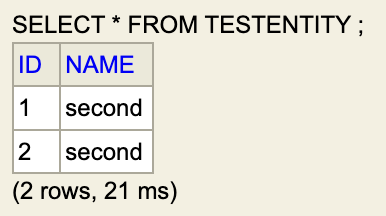

# 1. JPA 의 타입 분류 : 엔티티 타입 & 값 타입

JPA 에서 타입은 크게 2 종류로 분류한다.

> <span style="color:#7898FB">**A. _엔티티 타입 : Entity types_**</span> [`[1]`](#reference)
>
> 엔티티 타입은 고유 식별자 (PK) 를 소유해 **다른 객체들과 독립적으로 존재**할 수 있는 타입을 말한다.
>
> 엔티티는 고유 식별자를 통해 DB 테이블 row 와 연관된 Domain class model 이다.

> <span style="color:#7898FB">**B. _값 타입 : Value types_**</span> [`[2]`](#reference)
>
> 값 타입은 자기 자신의 lifecycle 을 정의하지 않는, 한낱 데이터에 불과한 타입을 말한다.
>
> 값 타입의 lifecycle 은 이를 소유하는 엔티티에 의해 정의된다.

```java

@Entity
class EntityType {
    /* ... id 생략 ... */

    private String basicTypes;

    @Embedded
    private EmbeddedTypes embeddedTypes;

    @ElementCollection
    private List<String> collectionTypes
            = new ArrayList<>();

    @ManyToOne
    private OtherEntity bEntity;
}

@Embeddable
class EmbeddedTypes {/* ... */
}
```

위 코드에서 _엔티티 타입_, (`EntityType` 입장에서) _값 타입_ 을 분류하면 다음과 같다.

|                      타입                       |                                                            대상                                                             |
|:---------------------------------------------:|:-------------------------------------------------------------------------------------------------------------------------:|
| <span style="color:#7898FB">**엔티티 타입**</span> |                            <span style="color:#7898FB">**`EntityType`, `OtherEntity`**</span>                             |
|  <span style="color:#7898FB">**값 타입**</span>  | <span style="color:#7898FB">**`String basicTypes`, `EmbeddedTypes embeddedTypes`, `List<String> collectionTypes`**</span> |

이들을 정말 쉽게 구분하는 방법이 있다. _엔티티 타입_ 은 `@Entity` 가 붙은 클래스 타입이고, _값 타입_ 은 아래 분류 중 하나이다.

- _기본값 타입 : Basic types_

  `int`, `double`, `String`, `LocalDateTime` 등 기본적의 타입들

- _내장값 타입: Embedded types_

  `@Embeddable` 이 붙은 클래스 타입

- _컬렉션값 타입 : Collection types_

  `Collection` 또는 `Map` 을 상속한 타입

---

# 2. 값 타입의 세부 분류 : _Basic, Embedded, Collection values_

엔티티 타입은 이전 학습한 내용을 통해 충분히 이해했을 것이라 생각한다. 그럼 JPA 의 값 타입을 집중해서 알아보자.

JPA 의 값 타입은 (이전에 잠깐 보여줬지만) 세부적으로 3 종류로 나뉜다.

> <span style="color:#7898FB">**기본 값 타입 : _Basic type values_**</span>
>
> 기본 값 타입은 Java 의 타입을 DB column 타입으로 맵핑하기 위해 존재한다.
>
> 대표적으로 아래와 같은 타입이 있으며, 자세한 내용은 [`[3]`](#reference) 을 참고하자.
>
> - Java primitives & Primitive wrappers
> - `String`, `BigInteger`, `BigDecimal`
> - `LocalDate`, `LocalDateTime`, `Instant`
> - `byte[]`, `Byte[]`, `char[]`, `Character[]`
> - Any enum & Any types that implements `java.io.Serializable`
> - `UUID` (Hibernate 에서만 가능할 수도 있다)
>
> 더불어 기본 값 타입들의 속성들은 INSERT, UPDATE 쿼리시 "어떤 값으로 구성되게" 만들 수 있는데, 대표적으로 `@CreationTimestamp`, `@UpdateTimestamp` 가 있다.
>
> 자세한 내용은 [`[4]`](#reference) 에 상세히 적혀있으니 참고하자.

> <span style="color:#7898FB">**내장 값 타입 : _Embedded type values_**</span>
>
> 내장 값 타입은 종종 **_"복합 값 타입"_** 이라 불리기도 하며, 의미 그대로 여러 값 타입을 복합적으로 묶어 사용할 때 사용된다.
>
> **`@Embeddable` 또는 `@Embedded` 어노테이션** 을 통해 엔티티 종속을 명시하며, (당연하지만) 사용하려면 엔티티 필드에 내장 값 타입 필드가 반드시 존재해야 한다.

> <span style="color:#7898FB">**컬렉션 값 타입 : _Collection type values_**</span>
>
> 컬렉션 값 타입은 **`Collection` 또는 `Map` 를 통해 "값" 을 저장하는 타입을 말한다.**
>
> 때문에 `List<String>`, `List<EmbeddedType>` 은 컬렉션 값 타입이지만, `List<OtherEntity>` 는 이로 분류되지 않는다.
>
> (JPA 도 이를 따르는지는 모름) Hibernate 는 `ARRAY`, `BAG`, `LIST`, `SET` 등의 _"Semantics"_ 를 지원하며, 이들에 따라 실 테이블 구조가 달라질 수 있다.
>
> (Semantics 의 영문 뜻은 _"의미론"_ 인데... 정확히 뭘 말하는지 모르겠다.)

---

# 3. 내장 값 타입

<span style="color:#7898FB">**내장 값 타입은 `@Embeddable` 혹은 `@Embedded`**</span> 를 통해 구성할 수 있다.

내장 값 타입에 해당하는 클래스에 `@Embeddable` 를 사용하거나, 엔티티 필드에 `@Embedded` 를 사용해 구성할 수 있다.

```java

@Embeddable
class EmbeddedA {

    private String a;
}

class EmbeddedB {

    private String b;
}

@Entity
class TestEntity {

    /* ... id 생략 ... */

    // @Embeddable 이 붙어있으면 @Embedded 를 생략할 수 있다.
    public EmbeddedA a;

    @Embedded
    public EmbeddedB b;
}
```

```
Hibernate: 
    create table TestEntity (
       id bigint not null,
        a varchar(255),
        b varchar(255),
        primary key (id)
    )
```

만약 아래처럼 내장 값 타입의 속성과 어느 다른 속성이 중복된다면 `@AttributeOverride` 혹은 `@AttributeOverrides` 를 이용해 해결할 수 있다.

```java

@Embeddable
class EmbeddedType {

    public String duplicate;
}

@Entity
@AttributeOverride(
        name = "duplicate",
        column = @Column(name = "entity_duplicate")
)
public class TestEntity {

    /* ... id 생략 ... */

    // 해당 column 이 entity_duplicate 로 변경됨.
    public String duplicate;

    @Embedded
    public EmbeddedType embeddedType;
}
```

```
Hibernate: 
    create table TestEntity (
       id bigint not null,
        entity_duplicate varchar(255),
        duplicate varchar(255),
        primary key (id)
    )
```

코드를 보면 알겠지만 내장 값 타입은 **결국 어떤 클래스이다.** 때문에 <span style="color:#7898FB">**어느 한 내장 타입을 두 엔티티가 공유해, 의도치 않은 update 가 일어나지 않도록 주의**</span> 해야 한다.

```java

@Entity
class TestEntity {

    /* ... id, 생성자 생략 ... */

    @Embedded
    public EmbeddedType ref;
}

@Embeddable
class EmbeddedType {

    /* ... 생성자 생략 ... */

    public String name;
}

EmbeddedType embedded = new EmbeddedType("first");
TestEntity e1 = new TestEntity(embedded);
TestEntity e2 = new TestEntity(embedded);

// 트랜잭션 시작 생략
em.persist(e1);
em.persist(e2);
em.flush();
System.out.println("==================FLUSH==================");

e1.ref.name ="second";
// 트랜잭션 커밋 생략
```

```
// create
Hibernate: 
    create table TestEntity (
        id bigint not null,
        name varchar(255),
        primary key (id)
    )

...

// insert
Hibernate: 
    /* insert for
        scripts.entities.TestEntity */insert 
    into
        TestEntity (name, id) 
    values
        (?, ?)
Hibernate: 
    /* insert for
        scripts.entities.TestEntity */insert 
    into
        TestEntity (name, id) 
    values
        (?, ?)
==================FLUSH==================
Hibernate: 
    /* update
        for scripts.entities.TestEntity */update TestEntity 
    set
        name=? 
    where
        id=?
Hibernate:          // INSERT 쿼리가 2 번 나가는 걸 볼 수 있다.
    /* update
        for scripts.entities.TestEntity */update TestEntity 
    set
        name=? 
    where
        id=?
```

<!-- avoid-reference-1.png -->

<p align="center">
    
</p>

위처럼 `embedded` 객체가 공유되면 JPA 의 Dirty checking 때문에 두 엔티티의 `NAME` 이 모두 변경될 수 있다.
이를 방지하는 방법은 많으나, 그 중 record 를 이용하는 게 좋아 보인다.

```java
@Embeddable
public record EmbeddedType(
        String name
) { }
```

참고로 내장 값 타입으로 record 를 이용하기 위해선 Hibernate `6.2 >=`, Jakarta Persistence `3.2 >=` 가 필요하다.

- [Using Java records as JPA embeddables - StackOverflow](https://stackoverflow.com/questions/68486938/using-java-records-as-jpa-embeddables)
- [Java Records as Embeddables with Hibernate 6 - Thorben Janssen's blog](https://thorben-janssen.com/java-records-embeddables-hibernate/)

---

# 4. 컬렉션 값 타입

<span style="color:#7898FB">**컬렉션 값 타입은 `Collection`, `Map` 의 서브타입이면서 _Basic types_, _Embedded types_ 를 저장하는 타입을 지칭한다.**</span>

컬렉션 값 타입을 사용하기 위해선 `@ElementCollection` 을 이용해야 하고, 부가적으로 `@CollectionTable` 을 통해 세부 내용을 설정할 수 있다. 

```java
@Embeddable
record EmbeddedType(String embedded) { }

@Entity     // [0]
class TestEntity {

    /* ... id 생략 ... */

    // [1]
    @ElementCollection
    public final List<EmbeddedType> embeddedCollections
            = new ArrayList<>();

    // [2]
    @ElementCollection
    public final List<String> strings
            = new ArrayList<>();

    // [3]
    @ElementCollection
    @CollectionTable(
            name = "STRING_COLLECTION_TABLE",
            joinColumns = @JoinColumn(name = "FK")
    )
    public final List<String> stringsWithCollectionTable
            = new ArrayList<>();
}
```

```
// create
Hibernate:      // [3]
    create table STRING_COLLECTION_TABLE (
        FK bigint not null,   // <-- column 명 설정
        stringsWithCollectionTable varchar(255)
    )
Hibernate:      // [0]
    create table TestEntity (
        id bigint not null,
        primary key (id)
    )
Hibernate:      // [1]
    create table TestEntity_embeddedCollections (
        TestEntity_id bigint not null,
        embedded varchar(255)
    )
Hibernate:      // [2]
    create table TestEntity_strings (
        TestEntity_id bigint not null,
        strings varchar(255)
    )

// apply constraint
Hibernate:      // [3]
    alter table if exists STRING_COLLECTION_TABLE 
       add constraint FKjbbnr5xihcio260ji8wcqrtiv 
       foreign key (FK) 
       references TestEntity
Hibernate:      // [1]
    alter table if exists TestEntity_embeddedCollections 
       add constraint FK7dq1ic3300jtgjtm6r7i1ik79 
       foreign key (TestEntity_id) 
       references TestEntity
Hibernate:      // [2]
    alter table if exists TestEntity_strings 
       add constraint FK6gvnp6uhj6p14qb8jr7w4a4sc 
       foreign key (TestEntity_id) 
       references TestEntity
```

기본적으로 컬렉션 값 타입은 다수의 값을 저장하므로 별도의 테이블이 필요하다. 또한 "값 타입" 이므로 PK 가 존재하지 않고 오직 `TestEntity` PK 와 외래키 제약조건만 설정된 것을 볼 수 있다.

더불어 Hibernate 공식문서에 따르면 컬렉션 값 타입에 따라 _Semantics_ 가 선택되어 작동된다 하며, 대표적으로 아래의 Semantics 가 있다.

| _Semantics_ |                         설명                          |             연관된 Java 타입              |
|:-----------:|:---------------------------------------------------:|:------------------------------------:|
|    ARRAY    |                    객체 또는 원시타입 배열                    |       배열 (`int[]`, `UUID[]` 등)       |
|     BAG     |         중복된 원소가 존재할 수 있고 순서가 없는 Collection          |          `None` : `@Bag` 이용          |
|   ID_BAG    |    원소별 식별자 (DB 에도 PK 추가됨) 를 추가해 원소별 식별이 가능한 BAG     | `None` : `@Bag` + `@CollectionId` 이용 |
|    LIST     |    원소별 식별자는 없지만 순서는 존재하는 BAG. Java 의 `List` 와 동일    |                `List`                |
|     SET     | 원소별 식별자는 없지만 원소간 중복은 허용하지 않는 BAG. Java 의 `Set` 과 동일 |                `Set`                 |
|     MAP     |         Key 값과 value 를 맵핑. 이 때 DB 에도 PK 추가됨         |                `Map`                 |

이들을 간단히 사용해보면 다음과 같다.

```java
@Entity     // [0]
class TestEntity {

    /* ... id 생략 ... */

    @Bag
    @ElementCollection      // [1]
    public final List<Integer> bag = new ArrayList<>();

    @Bag
    @CollectionId
    @ElementCollection      // [2]
    public final List<Integer> idBag = new ArrayList<>();

    @ElementCollection      // [3]
    public final List<Integer> list = new ArrayList<>();

    @ElementCollection
    @Column(name = "SET_COL")   // [4]
    public final Set<Integer> set = new HashSet<>();

    @ElementCollection          // [5]
    public final Map<Integer, Integer> map = new HashMap<>();
}

```

```
Hibernate:    // [0]
    create table TestEntity (
        id bigint not null,
        primary key (id)
    )
Hibernate:    // [1]
    create table TestEntity_bag (
        bag integer,
        TestEntity_id bigint not null
    )
Hibernate:    // [2]
    create table TestEntity_idBag (
        idBag integer,
        TestEntity_id bigint not null
    )
Hibernate:    // [3]
    create table TestEntity_list (
        list integer,
        TestEntity_id bigint not null
    )
Hibernate:    // [5]
    create table TestEntity_map (
        map integer,
        map_KEY integer not null,
        TestEntity_id bigint not null,
        primary key (map_KEY, TestEntity_id)
    )
Hibernate:    // [4]
    create table TestEntity_set (
        SET_COL integer,
        TestEntity_id bigint not null
    )

/* ... 제약조건은 생략 ... */
```

사실 컬렉션 값 타입이 그렇게 유용하진 않다.
애초에 _Basic type_ 은 엔티티의 속성 그 자체이며, _Embedded type_ 은 엔티티와 `1:1` 관계로만 존재할 수 있다. 때문에 이들의 PK 가 존재하지 않더라도 엄청난 문제가 되지는 않는다.

하지만 _Collection type_ 은 다르다. 관련된 데이터가 다른 테이블에 저장됨은 물론, (대부분의 경우) PK 가 존재하지 않아 식별에 어려움을 겪기 때문이다.

따라서 <span style="color:#7898FB">**컬렉션 값 타입을 사용할 때 해당 개체가 정말 "값" 으로 필요한지 생각하고, 그렇지 않으면 차라리 엔티티로 승격시키는 것이 좋다.**</span>

---

# 5. Hibernate 공식 문서

사실 위에서 설명한 내용들은 전체 내용의 극히 일부분으로, 정말 기초적인 사용법만을 설명하였다.

혹시 개발을 진행하다 어딘가 막혔거나 잘 모르겠으면 아래 공식 문서를 참고하자.

- [Hibernate ORM User Guide](https://docs.jboss.org/hibernate/orm/6.6/userguide/html_single/Hibernate_User_Guide.html)
    - [3.3. Embeddable values](https://docs.jboss.org/hibernate/orm/6.6/userguide/html_single/Hibernate_User_Guide.html#embeddables)
    - [3.9. Collections](https://docs.jboss.org/hibernate/orm/6.6/userguide/html_single/Hibernate_User_Guide.html#collections)

---

## Reference

- [Hibernate ORM User Guide](https://docs.jboss.org/hibernate/orm/6.6/userguide/html_single/Hibernate_User_Guide.html)
    - [3.1.2. Entity types](https://docs.jboss.org/hibernate/orm/6.6/userguide/html_single/Hibernate_User_Guide.html#categorization-entity)
        - `[1]` : Entities, by nature of their unique identifier, exist independently of other objects whereas values do not. Entities are domain model classes which correlate to rows in a database table, using a unique identifier. Because of the requirement for a unique identifier, entities exist independently and define their own lifecycle.
    - [3.1.1. Value types](https://docs.jboss.org/hibernate/orm/6.6/userguide/html_single/Hibernate_User_Guide.html#categorization-value)
        - `[2]` : A value type is a piece of data that does not define its own lifecycle. It is, in effect, owned by an entity, which defines its lifecycle.
    - `[3]` : [3.2. Basic values](https://docs.jboss.org/hibernate/orm/6.6/userguide/html_single/Hibernate_User_Guide.html#basic)
    - `[4]` : [3.2.55. Generated properties](https://docs.jboss.org/hibernate/orm/6.6/userguide/html_single/Hibernate_User_Guide.html#mapping-generated)

---
