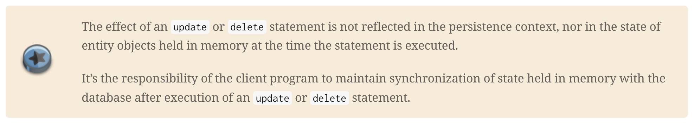
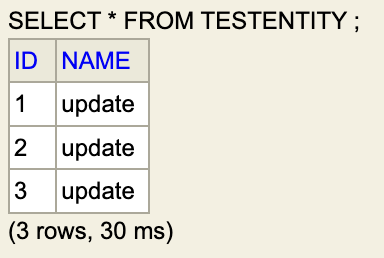
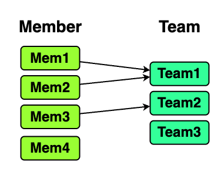

# 1. What is JPQL?

_JPQL_ 은 _Java Persistence Query Language_ 의 약어로, <span style="color:#7898FB">**SQL 을 추상화한 객체 지향 쿼리 언어**</span> 이다. 쉽게 생각해 JPA 쿼리 language 라 할 수 있다.

JPQL 의 문법은 SQL 과 매우 유사하지만 근본적으로 다른 점이 있다. SQL 은 _"문자열"_ 에 가깝지만 **JPQL 은 객체에 기반한 쿼리 언어** 인 점이다.

SQL 을 공부하다보면 한번쯤 _SQL injection_ 에 대해 들어본 적이 있을 것이다. 
이는 동적 쿼리를 위해 문자열을 조작하다 발생하는 문제로, 이를 막고자 `java.sql.PreparedStatement` 같은 것이 존재한다.

그런데 JPQL 은 객체에 기반한 언어이므로 SQL injection 에 강함은 물론, DBMS 에 따른 _"문법 제약"_ 에 자유롭다.

가장 대표적인 예시가 MySQL, Oracle 에서의 페이징이다.

```java
// 트랜잭션 생성 & Member 엔티티 정의 생략
IntStream.range(0, 10)
        .mapToObj(String::valueOf)
        .map(Member::new)
        .forEach(em::persist);
em.getTransaction().commit();   // 커밋

// limit 5 offset 0     : PK 0 번부터 시작해 5 개의 row 를 조회
String jpql = "SELECT m from Member m";
List<Member> result = em.createQuery(jpql, Member.class)
        .setFirstResult(0)
        .setMaxResults(5)
        .getResultList();
```

- OracleDialect

    ```
    ...
    
    Hibernate: 
        /* SELECT
            m 
        from
            Member m */ select
                m1_0.id,
                m1_0.name 
            from
                Member m1_0 
            offset
                ? rows 
            fetch
                first ? rows only
    ```

- MySqlDialect

    ```
    ...
    
    Hibernate: 
        /* SELECT
            m 
        from
            Member m */ select
                m1_0.id,
                m1_0.name 
            from
                Member m1_0 
            limit
                ?, ?
    ```

MySQL 은 `OFFSET`, `LIMIT` 를 통해 페이징을 처리할 수 있다. 하지만 Oracle 의 경우, 12c 이전 버전은 유사한 예약어 조차 없어 `row_num` 과 서브쿼리를 이용해야 했고, 그 이후에는 `OFFSET`, `FETCH` 를 통해 페이징을 처리할 수 있다.

즉, JPQL 이 없다면 DBMS 에 따라 쿼리를 교체해야 하는 불편한 상황이 일어나는 것이다. 때문에 JPQL 은 JPA 의 핵심 기능 중 하나이며 복잡한 쿼리를 객체세상에서 구성할 수 있게 해준다.

JPQL 의 문법은 SQL 과 거의 유사하므로 자세한 내용은 아래 공식 문서를 참고하자.

- [Kodo™ 4.2.0 Developers Guide for JPA/JDO - Oracle documentation](https://docs.oracle.com/html/E13946_04/index.html)
  - [10.2. JPQL Language Reference](https://docs.oracle.com/html/E13946_04/ejb3_langref.html)
- [A Guide to Hibernate Query Language - Hibernate documentation](https://docs.jboss.org/hibernate/orm/6.5/querylanguage/html_single/Hibernate_Query_Language.html#preface)

JPQL 자체는 Java 표준 스펙이어서 Oracle 문서가 더 표준에 가깝다. Hibernate 또한 이를 준수하지만 추가로 사용자의 편의를 위해 몇몇 기능을 더 제공한다. [`[1]`](#reference)
때문에 위 문서를 보면 Oracle 은 JPA 라 명명하고 Hibernate 는 HQL (Hibernate Query Language) 라 명명한다.

여튼 JPQL 의 기본 문법은 SQL 과 유사하니 이번 글에는 다음 내용들만 골라 설명하겠다.

- [<span style="color:#7898FB">**JPQL DML 과 엔티티 별칭**</span>](#2-jpql-dml-과-엔티티-별칭)
- [<span style="color:#7898FB">**경로 표현식과 JPQL 의 타입 표현**</span>](#3-경로-표현식과-jpql-의-타입-표현)
- [<span style="color:#7898FB">**결과 조회 API 와 파라미터 바인딩**</span>](#4-결과-조회-api-와-파라미터-바인딩)
- [<span style="color:#7898FB">**프로젝션과 페이징 API**</span>](#5-프로젝션과-페이징-api)

---

# 2. JPQL DML 과 엔티티 별칭

SQL 에서 DML 라 하면 `SELECT`, `UPDATE`, `DELETE`, `INSERT` 을 뜻하며, <span style="color:#7898FB">**JPQL 은 이 중 `SELECT`, `DELETE`, `DELETE` 를 지원**</span> 한다.

참고로 <span style="color:#7898FB">**HQL 은 `INSERT` 도 가능**</span> 하다.

```java
@Entity(name = "MemberEntity")
public class Member {

    /* ... id 생략 ... */
    public String name;
}


String select = "SELECT m FROM MemberEntity m"
String update = "UPDATE MemberEntity m SET m.name = :name WHERE m.id = :id"
String delete = "DELETE MemberEntity m WHERE m.id = :id"
String hqlInsert = "INSERT INTO MemberEntity (name) VALUES (:name1), (:name2)"
```

위 JPQL `String` 을 보면 `MemberEntity m` 과 같은 구문이 존재하는 것을 알 수 있다
이는 **JPQL 에 querying 할 엔티를 지칭하는 구문**으로 **_"별칭" (alias)_** 라 부른다.

<span style="color:#7898FB">SQL 의 경우 `... AS M` 같은 "별칭" 은 문법적 선택이지만 **JPQL 에서는 필수적이다.**</span>

각각의 DML 은 SQL 과 거의 동일한 Clause 를 지원한다. (`?` 는 Optional)

- `UPDATE` : `[SET ... VALUES]` `[WHERE]?`
- `DELETE` : `[WHERE]?`
- `INSERT` : None
- `SELECT` : `[WHERE]?` `[GROUP BY]? [HAVING]?` `[ORDER BY]?`

물론 위 Clause 는 전체 중 간단히 대표적인 내용만 나열한 것이다.
Hibernate 문서 [`[2]`](#reference) 에 들어가보면 SQL Clause 뿐만 아니라 엔티티 Clause 도 포함해 [_BNF 표기법_](https://en.wikipedia.org/wiki/Backus%E2%80%93Naur_form) 으로 나타내고 있으니 자세히 알고 싶으면 참고하자.


---

# 3. 경로 표현식과 JPQL 의 타입 표현

JPQL 은 `.` 연산자를 통해 어느 엔티티의 필드를 지칭하며 경로 표현식을 구성한다.
JPQL 은 이 경로 표현식을 해석해 실 query 를 생성하며, 이 때 사용될 수 있는 엔티티의 필드는 크게 <span style="color:#7898FB">**_상태 필드, 연관 필드_**</span> 로 분류된다.

|                                분류                                |           설명            |            예시            |
|:----------------------------------------------------------------:|:-----------------------:|:------------------------:|
|    <span style="color:#7898FB">**상태 필드 (State field)**</span>    |   엔티티의 단순 값에 해당하는 필드    | `name`, `id`, `embedded` |
| <span style="color:#7898FB">**연관 필드 (Association field)**</span> | 해당 엔티티와 연관된 "엔티티 지칭" 필드 |    `team`, `members`     |

다음 예시를 보자.

```java
@Embeddable
class EmbeddedType {

    public Integer val1;
    public Integer val2;

    @ManyToOne(cascade = CascadeType.PERSIST)
    public Team team;

    /* ... 생성자 생략 ... */
}

@Entity
class Member {

    /* ... id 생략 ... */
  
    @Embedded
    public EmbeddedType embedded;
}

@Entity
class Team {
    /* ... id 생략 ... */

    @OneToMany(mappedBy = "embedded.team")
    public List<Member> members;
}
```

참고로 내장 값 타입에서도 (결국 어느 엔티티에 속하게 되므로) `@ManyToOne`, `@OneToMany` 등의 엔티티 연관관계를 지칭할 수 있다.

```
Hibernate: 
    create table Member (
        val1 integer,
        val2 integer,
        id bigint not null,
        team_id bigint,
        primary key (id)
    )
Hibernate: 
    create table Team (
        id bigint not null,
        primary key (id)
    )
Hibernate: 
    alter table if exists Member 
       add constraint FK5nt1mnqvskefwe0nj9yjm4eav 
       foreign key (team_id) 
       references Team
```

위 상황에서 각 필드별로 JPQL 예시를 들면 다음과 같다.

- 상태 필드

  ```
  SELECT m.id FROM Member m             // 상태 필드 : id
  SELECT m.embedded FROM Member m       // 상태 필드 : embedded
  SELECT m.embedded.val1 FROM Member m  // 상태 필드 : val1
  SELECT m.embedded.val2 FROM Member m  // 상태 필드 : val2
  ```

- 연관 필드

  ```
  SELECT m.embedded.team FROM Member m  // 연관 필드 : team
  SELECT t.members FROM Team t          // 연관 필드 : members
  ```

필드의 분류는 사실 `연관 필드 - 그 외 나머지` 라 생각해 분류하는 것이 더 쉽다.
연관 필드는 예상했듯 `@??To??` 등의 어노테이션으로 다른 엔티티와 맺어진 연관관계를 칭하는 필드이다.

이 때 주의할 점은 <span style="color:#7898FB">**연관 필드가 JPQL 에 속해 있으면 묵시적 내부 조인 (inner join) 이 발생하며, `@???ToMany` 로 주어진 연관 필드는 더이상의 탐색이 불가능**</span> 하다는 점이다.

```
SELECT t.members ...  // <- members 이후로 더 탐색 불가능
SELECT m.embedded.team ... // <- team 이후로 더 탐색 가능 : team.id, team.members
```

내부 조인의 경우 이후 JPQL 의 join 을 설명할 때 자세히 알아보겠다. 지금은 간단히 예상치 못한 JOIN 문이 만들어 질 수 있다 생각하자.

JPQL 의 타입은 크게 다음 6 가지로 나눌 수 있다.

- 엔티티 타입
- Numeric value
- 문자열
- Date/Time
- Booleans
- Enum

참고로 Enum 타입의 경우 아래처럼 **enum 이 속한 패키지명을 명시해 JPQL 구문에 사용할 수 있다.**

```java
package scripts.entities;

enum MemberType {
    USER, ADMIN
}

String q = "SELECT m FROM Member m " 
        + " WHERE m.memberType = scripts.entities.MemberType.ADMIN";
```

---

# 4. 결과 조회 API 와 파라미터 바인딩

HQL 의 DML 은 `SELECT`, `UPDATE`, `DELETE`, `INSERT` 가 있고, 이들 중 <span style="color:#7898FB">**`SELECT` 를 제외한 DML 은 모두 `.executeUpdate()` 메서드를 통해 쿼리 결과를 조회**</span> 할 수 있다.

```java
String insert = "INSERT Member (name) VALUES (:name1), (:name2)";
String update = "UPDATE Member SET memberType = :memberType";
String delete = "DELETE FROM Member where id = :id";

System.out.println("============BEFORE INSERT============");
em.createQuery(insert)
        .setParameter("name1", "mem1")
        .setParameter("name2", "mem2")
        .executeUpdate();

System.out.println("============BEFORE UPDATE============");
em.createQuery(update)
        .setParameter("memberType", MemberType.USER)
        .executeUpdate();

System.out.println("============BEFORE DELETE============");
em.createQuery(delete)
        .setParameter("id", 1L)
        .executeUpdate();
```

```
============BEFORE INSERT============
Hibernate: 
    /* INSERT Member
        (name) 
    VALUES
        (:name1), (
            :name2
        ) */ insert 
    into
        Member(name, id) 
    values
        (?, ?), (
            ?, ?
        )
...
============BEFORE UPDATE============
Hibernate: 
    /* UPDATE
        Member 
    SET
        memberType = :memberType */ update Member m1_0 
    set
        memberType=?
============BEFORE DELETE============
Hibernate: 
    /* DELETE 
    FROM
        Member 
    where
        id = :id */ delete 
    from
        Member m1_0 
    where
        m1_0.id=?
```

<span style="color:#7898FB">**`.executeUpdate()` 메서드는 해당 쿼리로 인해 영향받은 엔티티의 수를 반환한다.**</span>

반면 <span style="color:#7898FB">**`SELECT` 의 경우 `.getResultList()`, `.getSingleResult()` 메서드를 통해 쿼리 결과를 조회할 수 있다.**</span>

```java
Member memberWithTeam = new Member(new EmbeddedType(new Team()));
em.persist(new Member());
em.persist(memberWithTeam);
em.flush();

String select1 = "SELECT m FROM Member m";
String select2 = "SELECT m.embedded.team FROM Member m where m.id = :id";

System.out.println("==============BEFORE SELECT1==============");
List<Member> allMembers = em.createQuery(select1, Member.class)
        .getResultList();

System.out.println("==============BEFORE SELECT2==============");
Team findTeam = em.createQuery(select2, Team.class)
        .setParameter("id", memberWithTeam.id)
        .getSingleResult();
System.out.println("==============AFTER==============");

allMembers.forEach(System.out::println);
System.out.println(findTeam);
```

```
==============BEFORE SELECT1==============
Hibernate: 
    /* SELECT
        m 
    FROM
        Member m */ select
            m1_0.id,
            m1_0.team_id,
            m1_0.val1,
            m1_0.val2,
            m1_0.memberType,
            m1_0.name 
        from
            Member m1_0
==============BEFORE SELECT2==============
Hibernate: 
    /* SELECT
        m.embedded.team 
    FROM
        Member m 
    where
        m.id = :id */ select
            t1_0.id 
        from
            Member m1_0 
        join
            Team t1_0 
                on t1_0.id=m1_0.team_id 
        where
            m1_0.id=?
==============AFTER==============
Member{id=1, embedded=null}
Member{id=2, embedded=EmbeddedType{team=Team{id=1}}}
Team{id=1}
```

참고로 `.getSingleResult()` 는 조회 결과가 없거나 2 개 이상이면 에러를 발생시킨다.

앞선 예시를 보면 `... m.id = :id` 와 같은 JPQL 과 `.setParameter("id", memberWithTeam.id)` 처럼 메서드를 사용하는 것을 볼 수 있다.
이는 JPQL 의 파라미터 바인딩으로, JPQL 구문에 `:[변수명]` 을 정의하고 `.getSingleResult([변수명], [객체])` 을 통해 해당 자리에 어느 객체, 값을 넣을지 설정한다.

JDBC 의 `PreparedStatement` 과 사용 방법이 매우 유사하므로 큰 어려움은 없을 것이라 생각한다.

---

# 5. 프로젝션과 페이징 API

JPQL `SELECT` DML 을 통해 우리가 원하는 객체 또는 값을 제공받을 수 있다. 이 때 이 제공받는 연산을 _"프로젝션, Projection"_ 이라 칭한다.

```java
em.persist(new Member(new EmbeddedType(new Team())));
em.flush();

String projectEntity = "SELECT m FROM Member m";        // 엔티티 자체를 투영
String projectScalar = "SELECT m.name FROM Member m";   // name 필드를 투영
String projectEmbedded = "SELECT m.embedded FROM Member m"; // embedded 필드를 투영
String projectMultiple = "SELECT m, m.name, m.embedded FROM Member m";  // 여러 값을 투영

em.createQuery(projectMultiple, Object[].class)
        .getResultList()
        .forEach(arr -> System.out.println(Arrays.toString(arr)));
```

```
...
Hibernate: 
    /* SELECT
        m,
        m.name,
        m.embedded 
    FROM
        Member m */ select
            m1_0.id,
            m1_0.team_id,
            m1_0.val1,
            m1_0.val2,
            m1_0.memberType,
            m1_0.name 
        from
            Member m1_0
[Member{id=1, embedded=EmbeddedType{team=Team{id=1}}}, null, EmbeddedType{team=Team{id=1}}]
```

만약 `projectMultiple` 처럼 여러 값을 필요에 따라 투영할 때, 아래처럼 별도의 클래스를 정의해 `new ...` 로 명시함으로서 투영할 수 있다.

```java
record DTO(
        Member member,
        String name,
        EmbeddedType embedded
) { }

em.persist(new Member(new EmbeddedType(new Team())));

String projectViaDTO = "SELECT new scripts.DTO(m, m.name, m.embedded) FROM Member m";

em.createQuery(projectViaDTO, DTO.class)
        .getResultList()
        .forEach(System.out::println);
```

```
...
Hibernate: 
    /* SELECT
        new scripts.DTO(m, m.name, m.embedded) 
    FROM
        Member m */ select
            m1_0.id,
            m1_0.team_id,
            m1_0.val1,
            m1_0.val2,
            m1_0.memberType,
            m1_0.name 
        from
            Member m1_0
DTO[member=Member{id=1, embedded=EmbeddedType{team=Team{id=1}}}, name=null, embedded=EmbeddedType{team=Team{id=1}}]
```

또한 `SELECT` DML 시 아래처럼 `.setFirstResult()`, `.setMaxResults()` 메서드를 통해 페이징을 처리할 수 있다.

```java
IntStream.range(0, 10).forEach(i -> em.persist(
        new Member(new EmbeddedType(new Team()))
));

String projectViaDTO = "SELECT new scripts.DTO(m, m.name, m.embedded) FROM Member m";

// 첫 3 결과 생략 & 최대 5 개의 결과 투영
em.createQuery(projectViaDTO, DTO.class)
        .setFirstResult(3)
        .setMaxResults(5)
        .getResultList()
        .forEach(System.out::println);
```

```
...
Hibernate:        // 편하게 이해하려고 MySQL 이용
    /* SELECT
        new scripts.DTO(m, m.name, m.embedded) 
    FROM
        Member m */ select
            m1_0.id,
            m1_0.team_id,
            m1_0.val1,
            m1_0.val2,
            m1_0.memberType,
            m1_0.name 
        from
            Member m1_0 
        limit
            ?, ?
DTO[member=Member{id=4, embedded=EmbeddedType{team=Team{id=4}}}, name=null, embedded=EmbeddedType{team=Team{id=4}}]
DTO[member=Member{id=5, embedded=EmbeddedType{team=Team{id=5}}}, name=null, embedded=EmbeddedType{team=Team{id=5}}]
DTO[member=Member{id=6, embedded=EmbeddedType{team=Team{id=6}}}, name=null, embedded=EmbeddedType{team=Team{id=6}}]
DTO[member=Member{id=7, embedded=EmbeddedType{team=Team{id=7}}}, name=null, embedded=EmbeddedType{team=Team{id=7}}]
DTO[member=Member{id=8, embedded=EmbeddedType{team=Team{id=8}}}, name=null, embedded=EmbeddedType{team=Team{id=8}}]
```

---

# 6. JPQL 주의사항

지금까지 JPQL 의 기초 사용법을 알아보았다. JPQL 은 JPA 의 가장 강력한 기능 중 하나로 동적 쿼리에 거의 필수적이다.

하지만 강력한 만큼 JPQL 을 올바르게 사용하지 않으면 성능이 크게 저하될 수 있다.

때문에 **JPQL 을 이용할 때는 아래의 주의사항을 명심하자.**

---

## <span style="color:#7898FB">I. JPQL 실행 전 `flush` 가 일어난다.</span>

우리가 JPA 를 사용할 때 대부분 Hibernate 구현체를 사용하며 `FLUSH` 모드를 `AUTO` 로 사용한다.

이 때 Hibernate 문서에 따르면 `Auto flush` 사용시 아래의 경우에 flush 가 일어난다 적혀있다. [`[2]`](#reference)

- 트랜잭션을 COMMIT 할 때
- <span style="color:#7898FB">**JPQL/HQL 쿼리를 실행하기 직전**</span>
- 동기화가 등록되지 않은 Native SQL 실행 전

```java
em.persist(new TestEntity());

System.out.println("=============BEFORE JPQL=============");
List<TestEntity> thisHasToBeEmpty = em.createQuery(
        "SELECT te FROM TestEntity te", TestEntity.class
).getResultList();

System.out.println("=============AFTER JPQL=============");
thisHasToBeEmpty.forEach(System.out::println);
```

```
...
=============BEFORE JPQL=============
Hibernate: 
    /* insert for
        scripts.TestEntity */insert 
    into
        TestEntity (id) 
    values
        (?)
Hibernate: 
    /* SELECT
        te 
    FROM
        TestEntity te */ select
            te1_0.id 
        from
            TestEntity te1_0
=============AFTER JPQL=============
scripts.TestEntity@4b03cbad
```

지금까지 우리가 배운 내용으론 `em.flush()` 혹은 트랜잭션 COMMIT 이 없으므로, `SELECT te FROM TestEntity te` JPQL 결과는 비어있어야 한다.

하지만 출력을 보면 알 수 있듯 JPQL 실행 전 INSERT 쿼리가 발생하였으며 (`flush` 발생), 이로 인해 `thisHasToBeEmpty` 가 비어있지 않는 것을 볼 수 있다.

---

## <span style="color:#7898FB">II. `UPDATE`, `DELETE` JPQL DML 은 영속 컨텍스트에 반영되지 않는다.</span> 

Hibernate 는 `INSERT`, `UPDATE`, `DELETE` 구문을 _Mutation query_ 라 부르며, mutation query 를 실행할 때 아래의 내용을 고려해 사용하라 명시되어 있다. [`[3]`](#reference)

<!-- jpql-1.png -->

<p align="center">
  
</p>

> `UPDATE`, `DELETE` 구문은 영속 컨텍스트에 영향을 주지 않습니다.
> 
> 이는 즉 구문이 실행된 시점에 메모리에 존재하는 엔티티 객체, 그의 상태가 영향받지 않음을 의미합니다.
> 
> 따라서 `UPDATE`, `DELETE` 구문 시 `DB - 메모리` 간 _"상태 동기화"_ 는 클라이언트 프로그램이 담당해야 합니다.

즉, <span style="color:#7898FB">**`UPDATE`, `DELETE` JPQL 은 현 영속 컨텍스트를 무시하고 실행된다는 것이다.**</span>

(+ `INSERT` JPQL DML 은 결국 _"새로 생성된 행 개수"_ 만 파악할 수 있으므로 이 상황에서는 그렇게 큰 문제는 아니다.)

아래 예시를 보자.

```java
List<TestEntity> entities = IntStream.range(0, 3)
        .mapToObj(i -> new TestEntity("init"))
        .toList();

entities.forEach(em::persist);
em.flush();

em.createQuery("UPDATE TestEntity SET name = :name")
        .setParameter("name", "update")
        .executeUpdate();

entities.forEach(System.out::println);
```

```
...
Hibernate: 
    /* UPDATE
        TestEntity 
    SET
        name = :name */ update TestEntity te1_0 
    set
        name=?
TestEntity{id=1, name='init'}
TestEntity{id=2, name='init'}
TestEntity{id=3, name='init'}
```

<p align="center">
  
</p>

위 예시에서 우리는 `TestEntity` 의 이름을 `"init"` 으로 설정하고 JPQL 로 이름을 다시 `"update"` 라는 것으로 변경했다.

하지만 `entities.forEach(System.out::println);` 로 확인해보면 영속된 엔티티들의 이름이 아직도 `"init"` 인 것을 확인할 수 있다.

이는 즉, `UPDATE` JPQL 은 영속 컨텍스트를 무시하고 작동하는 것이고 어플리케이션의 치명적인 결함이 생길 수 있으니 주의하자.

---

## III. BULK 연산에 주의하라

해당 내용은 사실 앞선 `II` 와 연관되 있다. SQL 에서 BULK 란 다수의 작업을 하나의 쿼리로 진행하는 연산이다.

JPA 에서 BULK 연산을 하기 위해선 `UPDATE`, `DELETE`, `INSERT` JPQL DML 을 사용하는데, 이들은 앞서 말했듯 영속 컨텍스트를 무시하고 작동한다.

때문에 <span style="color:#7898FB">BULK 연산을 사용할 때는 **BULK 연산을 항상 먼저 실행** 하거나 **연산 수행 후, 영속 컨텍스트를 의도적으로 초기화** 시키는 것이 안전하다.</span>

---

## <span style="color:#7898FB">IV. `N + 1` 문제를 조심하라</span>

JPA 를 사용해본 사람은 `N + 1` 문제를 한번이라도 들어본 적이 있을 것이다.

`N + 1` 문제는 어느 구문이 하나의 쿼리르 끝날 것이라 예상했지만, 추가적인 N 번의 쿼리가 일어나는 문제를 말한다.

다음과 같은 상황을 생각해보자.

<p align="center">
  
</p>

`Member - Team` 이 `[N:1]` 관계로 존재하고 _"모든 `Member` 를 조회할 때, 그와 연관된 `Team` 들을 보고싶다"_ 는 요구사항이 발생했다 가정하자.

당신은 이를 해결하기 위해 `Member - Team` 을 양방향 연관관계로 맺고, `Member` 를 통해 `Team` 을 LEFT JOIN 하는 JPQL 을 작성했다.

```java
@Entity
class Member {
    /* ... id, toString 생략 ... */
  
    @ManyToOne
    public Team team;
}

@Entity
class Team {

    /* ... id, toString 생략 ... */
    public String name;
  
    @OneToMany(mappedBy = "team")
    public final List<Member> members = new ArrayList<>();
}


System.out.println("=============BEFORE JPQL=============");
String query = "SELECT m.id, m FROM Member m "
        + " LEFT JOIN m.team "
        + " ORDER BY m.id ASC";
List<Object[]> find = em.createQuery(query, Object[].class)
        .getResultList();

System.out.println("=============AFTER JPQL=============");
find.forEach(f -> System.out.println(Arrays.toString(f)));
```

당신은 JPA 가 `SELECT m.id, m FROM Member m LEFT JOIN m.team ...` JPQL 을 통해 `Member` 와 연관된 `Team` 들을 모두 영속할 것이라 생각했다.
하지만 실제 출력을 보면 살짝 다름을 알 수 있다.

```
=============BEFORE JPQL=============
Hibernate:            // <-- JPQL 실행 쿼리
    /* SELECT
        m.id,
        m 
    FROM
        Member m  
    LEFT JOIN
        m.team  
    ORDER BY
        m.id ASC */ select
            m1_0.id,
            m1_0.team_id 
        from
            Member m1_0 
        order by
            m1_0.id
Hibernate:            // <-- 추가 쿼리 발생
    select
        t1_0.id,
        t1_0.name 
    from
        Team t1_0 
    where
        t1_0.id=?
Hibernate:            // <-- 추가 쿼리 발생
    select
        t1_0.id,
        t1_0.name 
    from
        Team t1_0 
    where
        t1_0.id=?
=============AFTER JPQL=============
[1, Member{id=1, team=Team{id=2, name='Team1'}}]
[2, Member{id=2, team=Team{id=2, name='Team1'}}]
[3, Member{id=3, team=Team{id=3, name='Team2'}}]
[4, Member{id=4, team=null}]
```

실제 연관된 모든 `Team` 들이 영속된 것은 맞으나, JPA 가 이를 위해 추가적인 쿼리를 발생시킨 것을 볼 수 있다.

이것이 JPA 의 `N + 1` 문제이다.

`N + 1` 의 근본적 원인은 실제 쿼리를 보면 알 수 있다.

```
// SELECT m.id, m FROM Member m LEFT JOIN m.team ... JPQL
Hibernate:
    /* SELECT
        m.id,
        m 
    FROM
        Member m  
    LEFT JOIN
        m.team  
    ORDER BY
        m.id ASC */ select
            m1_0.id,          // 실 쿼리를 보면 Team 과 연관된 정보를
            m1_0.team_id      // column 에 넣지 않고 있다.
        from
            Member m1_0       // 즉, 해당 실 쿼리에서는 JPA 가
        order by              // 연관된 Team 들을 영속할 정보가 존재하지 않는다.
            m1_0.id
```

우리는 `SELECT m.id, m FROM Member m LEFT JOIN m.team ...` JPQL 을 통해 연관된 `Team` 을 영속하길 기대하였다. 하지만 실제 쿼리를 보면 오직 `m1_0.id`, `m1_0.team_id` 만 SELECT 하는 것을 볼 수 있다.

즉, <span style="color:#7898FB">**JPA 가 연관된 `Team` 을 영속시키고 싶어도 이에 해당하는 정보가 없어 어쩔 수 없이 추가 쿼리를 발생시킨 것이다.**</span>

따라서 위 `N + 1` 문제를 해결하기 위해선 SELECT 쿼리에 `Team` 정보가 포함되어야 한다.

- fetch join 을 통한 해결

  ```java
  String fetchJoin = "SELECT m.id, m FROM Member m "
          + " LEFT JOIN FETCH m.team "
          + " ORDER BY m.id ASC";
  ```
  
  ```
  =============BEFORE JPQL=============
  Hibernate: 
      /* SELECT
          m.id,
          m 
      FROM
          Member m  
      LEFT JOIN
          
      FETCH
          m.team  
      ORDER BY
          m.id ASC */ select
              m1_0.id,
              t1_0.id,
              t1_0.name 
          from
              Member m1_0 
          left join
              Team t1_0 
                  on t1_0.id=m1_0.team_id 
          order by
              m1_0.id
  =============AFTER JPQL=============
  [1, Member{id=1, team=Team{id=2, name='Team1'}}]
  [2, Member{id=2, team=Team{id=2, name='Team1'}}]
  [3, Member{id=3, team=Team{id=3, name='Team2'}}]
  [4, Member{id=4, team=null}]
  ```

- `m.team` 을 투영함으로서 해결

  ```java
  String includeTeamInProjection = "SELECT m.id, m, m.team FROM Member m "
          + " LEFT JOIN m.team "
          + " ORDER BY m.id ASC";
  ```
  
  ```
  =============BEFORE JPQL=============
  Hibernate: 
      /* SELECT
          m.id,
          m,
          m.team 
      FROM
          Member m  
      LEFT JOIN
          m.team  
      ORDER BY
          m.id ASC */ select
              m1_0.id,
              m1_0.team_id,
              t1_0.id,
              t1_0.name 
          from
              Member m1_0 
          left join
              Team t1_0 
                  on t1_0.id=m1_0.team_id 
          order by
              m1_0.id
  =============AFTER JPQL=============
  [1, Member{id=1, team=Team{id=2, name='Team1'}}, Team{id=2, name='Team1'}]
  [2, Member{id=2, team=Team{id=2, name='Team1'}}, Team{id=2, name='Team1'}]
  [3, Member{id=3, team=Team{id=3, name='Team2'}}, Team{id=3, name='Team2'}]
  [4, Member{id=4, team=null}, null]
  ```

두 해결방법 모두 `t1_0.id`, `t1_0.name` 처럼 `Team` 엔티티의 속성을 SELECT 에 포함시키는 것을 볼 수 있다.

---

## Reference

- `[1]` : [HQL과 JPQL의 관계 - Inflearn 강의 질문](https://www.inflearn.com/community/questions/1274628/hql%EA%B3%BC-jpql%EC%9D%98-%EA%B4%80%EA%B3%84?srsltid=AfmBOoqYOK6slE29OdBuvX5mPUyIVLgM3bMaqslaGs-QrSZNtKRWqxpD)
- [Hibernate ORM User Guide - Hibernate documentation](https://docs.jboss.org/hibernate/orm/6.5/userguide/html_single/Hibernate_User_Guide.html) 
  - `[2]` : [7.1. AUTO flush](https://docs.jboss.org/hibernate/orm/6.5/userguide/html_single/Hibernate_User_Guide.html#flushing-auto)
- [A Guide to Hibernate Query Language - Hibernate documentation](https://docs.jboss.org/hibernate/orm/6.5/querylanguage/html_single/Hibernate_Query_Language.html)
  - `[3]` : [1.5. Statement types](https://docs.jboss.org/hibernate/orm/6.5/querylanguage/html_single/Hibernate_Query_Language.html#statement-types)
