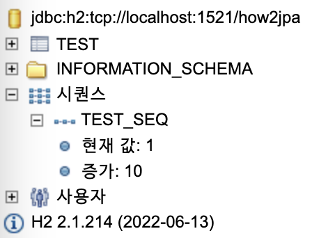
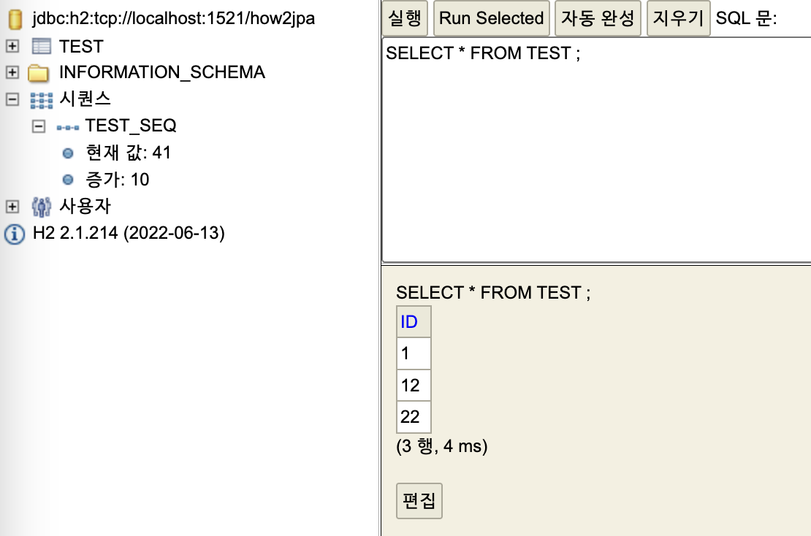

# `@GeneratedValue` 세부 내용

이전 내용을 상기시키면 `@GeneratedValue` 를 통해 PK 생성 전략을 설정할 수 있고, `TABLE`, `SEQUENCE`, `IDENTITY` 전략이 있었다.

이 중 `TABLE` 은 솔직히 성능상 바라보지도 않을 것 같아서 생략한다.

---

## 1. IDENTITY : PK 생성을 DB 에 위임?

IDENTITY 전략이 무엇인지 검색하면 대게 _"PK 생성을 DB 에 위임"_ 하는 전략이라 설명한다.

이 말이 틀린건 아닌데 뭐랄까 좀 많이 축약된 설명이라 느껴진다. 처음 배우는 입장에서 _"SEQUENCE 전략도 DB SEQUENCE 객체를 이용하니까 DB 에 위임받은 거 아니야?"_ 라 오해시킬 수 있는 설명이라 생각한다.

먼저 SEQUENCE 전략을 어떻게 사용하고 작동하는지 이해해 보자.

---

## 2. SEQUENCE 전략 먼저 이해하자

SEQUENCE 전략은 <span style="color:#7898FB">DB 에 SEQUENCE 개체를 생성하고 이를 활용해 PK 를 생성</span>한다.

```java

@Entity
@SequenceGenerator(
        name = "test-seq", sequenceName = "TEST_SEQ",
        initialValue = 1, allocationSize = 10
)
class Test {

    @Id
    @GeneratedValue(
            strategy = GenerationType.SEQUENCE,
            generator = "test-seq"
    )
    private Long id;
}
```

```
Hibernate: create sequence hibernate_sequence start with 1 increment by 1
Hibernate: create sequence TEST_SEQ start with 1 increment by 10
Hibernate: 
    create table Test (
       id bigint not null,
        primary key (id)
    )
```

위 DDL 을 보면 DB 에 `hibernate_sequence`, `TEST_SEQ` SEQ 개체를 생성하는 것을 볼 수 있다.

`hibernate_sequence` 는 SEQUENCE 전략 사용 시 기본적으로 만들어진다.

때문에 만약 `@GeneratedValue` 의 `generator` 를 지정해주지 않으면 이 `hibernate_sequence` 를 통해 PK 가 생성된다.

이제 JPA 로 엔티티를 영속하는 상황을 보자.

```java
void save() {
    System.out.println("----------BEFORE-----------");
    em.persist(new Test(...));    // 엔티티를 영속했다 가정
    System.out.println("----------AFTER-----------");
    em.getTransaction().commit();
    System.out.println("----------COMMIT-----------");
}

save();
```

```
----------BEFORE-----------
Hibernate: 
    call next value for TEST_SEQ
Hibernate: 
    call next value for TEST_SEQ
----------AFTER-----------
Hibernate: 
    /* insert scripts.entities.Test
        */ insert 
        into
            Test
            (id) 
        values
            (?)
----------COMMIT-----------
```

JPA 의 영속 컨텍스트를 생각했을 때, `em.persist( ... )` 를 사용해도 원래는 아무 로그가 찍히지 않아야 한다. `(쓰기 지연)`

SQL 을 보면 실제 insert 는 트랜잭션이 commit 시 일어남을 볼 수 있다. 그러면 `BEFORE`, `AFTER` 사이에 있는 저건 뭘까?

|                                엔티티 삽입 전 SEQ                                 |                                엔티티 삽입 후 SEQ                                 |
|:---------------------------------------------------------------------------:|:---------------------------------------------------------------------------:|
|  |  |

<span style="color:#7898FB">**SEQUENCE 전략에서 JPA 는 DB 에게 "미래에 저장할 ID 를 예약" 한다.**</span>

DB 에게 SEQ 를 증가요청을 보내 `(이전 값 + allocationSize)` 으로 만들고, JPA 는 `(이전값 ~ 이전값 + allocationSize)` 범위의 값을 PK 지정 시 사용하는 것이다. 

때문에 만약 같은 `EntityManagerFacotry` 에서 `save()` 를 2 번 사용해도 DB SEQ 가 더이상 증가하지 않는다.

```java
save();
save();
```
```
----------BEFORE-----------
Hibernate: 
    call next value for TEST_SEQ
Hibernate: 
    call next value for TEST_SEQ
----------AFTER-----------
Hibernate: 
    /* insert scripts.entities.Test
        */ insert 
        into
            Test
            (id) 
        values
            (?)
----------COMMIT-----------
----------BEFORE-----------     ## 여기서 BEFORE, AFTER 사이에 아무 로그도 찍히지 않는다. 
----------AFTER-----------      ## 아직 "예약한" PK 들이 남아있기 때문
Hibernate: 
    /* insert scripts.entities.Test
        */ insert 
        into
            Test
            (id) 
        values
            (?)
----------COMMIT-----------
```

때문에 만약 `EntityManagerFactory` 를 닫고 열고를 반복해 저장하면 아래 그림처럼 `ID` 가 들쭉날쭉한 것을 볼 수 있다.

```java
void initEmf() {
    if (emf != null)    {
        emf.close();
    }
    emf = Persistence.createEntityManagerFactory("H2");
}

void test() {
    initEmf();
    save();
}

test();
test();
test();
```

<!-- seq-3.png -->

<p align="center">
    
</p>

---

## 3. IDENTITY 전략을 이해하자

앞서 <span style="color:#7898FB">SEQUENCE 전략의 핵심은 **"JPA 가 PK 를 예약"**</span> 함에 있었다.
이를 통해 _"PK 생성을 DB 에 위임"_ 한다는 것이 무엇인지 조금 감이 잡힐 것이다.

IDENTITY 전략은 <span style="color:#7898FB">JPA 가 PK 를 미리 예약받거나 관리하지 않고 **insert 시 할당받는 전략**</span> 이다.

앞서 SEQ 전략과 동일하게 한번 실행해 보자.

- 엔티티 & DDL
    ```java
    @Entity
    public class Test {
    
        @Id @GeneratedValue(strategy = GenerationType.IDENTITY)
        private Long id;
    }
    ```
    
    ```
    Hibernate: 
        create table Test (
           id bigint not null auto_increment,
            primary key (id)
        ) engine=InnoDB
    ```

- 엔티티 영속

    ```java
    void save() {
        System.out.println("----------BEFORE-----------");
        em.persist(new Test(...));    // 엔티티를 영속했다 가정
        System.out.println("----------AFTER-----------");
        em.getTransaction().commit();
        System.out.println("----------COMMIT-----------");
    }
    
    save();
    ```
    
    ```
    ----------BEFORE-----------
    Hibernate: 
        /* insert scripts.entities.Test
            */ insert 
            into
                Test
                
            values
                ( )
    ----------AFTER-----------
    ----------COMMIT-----------
    ```

이게 어떻게 된 일인가? insert 쿼리가 `BEFORE`, `AFTER` 사이에, **트랜잭션 COMMIT 이전에** 일어났다!
우리가 배운 내용대로라면 쓰기 지연으로 인해 insert 쿼리가 `AFTER`, `COMMIT` 사이에 날라갔어야 한다.

앞서 IDENTITY 전략은 _"PK 생성을 DB 에 위임"_ 한다 언급했고, <span style="color:#7898FB">**이 때문에 JPA 와 DB 사이에 괴리가 일어난다.**</span>

JPA 는 동일 영속 컨택스트 (현 실습 상황에서는 `EntityManager`) 에서 영속된 엔티티의 동일성을 보장해야 한다.

```java
void showProperties(Object o)    {
  String className = o.getClass().getSimpleName();
  String memAddress = String.format(
          "%08x",
          System.identityHashCode(o)
  );

  String result = String.format(
          "\nOBJ \t\t: %s\n" +
          "CLASS \t: %s\n" +
          "MEM \t\t: %s\n",
          o, className, memAddress
  );

  System.out.println(result);
}

EntityManager em = emf.createEntityManager();
em.getTransaction().begin();

System.out.println("------------------START------------------");

// 한 엔티티를 영속
Test test = new Test();
em.persist(test);
em.getTransaction().commit();

// 영속한 엔티티 PK 를 통해 find (select)
Test find = em.find(Test.class, test.getId());

// 동일 영속 컨텍스트에서 JPA 는 test, find 가 동일한 객체임을 보장해야 됨
System.out.println("---> JPA 는 동일성을 보장한다 : " + (test == find));

showProperties(test);
showProperties(find);

System.out.println("------------------END------------------");
```

```
------------------START------------------
Hibernate: 
    /* insert scripts.entities.Test
        */ insert 
        into
            Test
            
        values
            ( )
---> JPA 는 동일성을 보장한다 : true

OBJ      : scripts.entities.Test@3a082ff4
CLASS    : Test
MEM      : 0x3a082ff4

OBJ      : scripts.entities.Test@3a082ff4
CLASS    : Test
MEM      : 0x3a082ff4
------------------END------------------
```

위 출력을 보면 SELECT 쿼리가 나가지 않음은 물론, `test`, `find` 가 완전히 동일한 객체 (identityHashCode 동일) 임을 알 수 있다.

여기서 문제가 발생한다. JPA 가 영속 엔티티간 동일성을 보장하기 위해선, **PK 값까지 결정되어 1 차 캐시에 저장** 되어야 한다.

그런데 IDENTITY 전략은 DB 에 PK 생성을 위임하므로, **DB 에 실제 insert 를 통해서만 엔티티의 PK 가 어느 값인지 확인할 수 있다.**

이러한 이유 때문에 <span style="color:#7898FB">**IDENTITY 전략은 트랜잭션 COMMIT 이전이라 하더라도 `em.persist( ... )` 호출 즉시 쓰기 지연 저장소를 flush 해 INSERT 쿼리를 생성한다.**</span>

<span style="color:#7898FB">**즉, IDENTITY 전략을 사용하면 의도치 않은 `flush` 가 발생할 수 있으며,**</span> **개인적으로 이 때문에 JPA 가 IDENTITY, SEQUENCE 를 구분해 놓았다 생각한다.**

---

## 4. IDENTITY 전략으로 인한 문제 : BATCH INSERT

앞선 설명으로 SEQUENCE, IDENTITY 두 전략의 작동 방식을 확인했고, IDENTITY 가 의도치 않은 `flush` 를 일으킬 수 있다는 사실을 확인하였다.

이는 매우 큰 단점으로 작용할 수 있는데, 대표적인 예시가 Bulk INSERT 이다.

간단히 말해 Bulk 는 어느 작업을 다수의 쿼리로 진행하지 않고 단 하나의 쿼리로 진행하는 작업이다.

```sql
-- 4 개의 Test 를 4 개의 쿼리로 생성
INSERT INTO Test values ();
INSERT INTO Test values ();
INSERT INTO Test values ();
INSERT INTO Test values ();

-- 새로운 4 개의 Test 를 한번의 쿼리로 생성
INSERT INTO Test values (), (), (), ();
```

그런데 IDENTITY 전략은 JPA 가 동일성을 보장하기 위해 `em.persist( ... )` 마다 `flush` 하므로, <span style="color:#7898FB">어플리케이션이 BULK INSERT 하지 않고 N 번의 SINGLE INSERT 를 발생시킬 수 있다.</span>

그럼 이걸 어떻게 해결할 수 있을까? 해결법을 검색해 아래의 글을 발견했다.

- [[JPA] Spring Data JPA 에서 Batch Insert 하기 (with. MySQL)](https://velog.io/@slolee/JPA-Spring-Data-JPA-%EC%97%90%EC%84%9C-Batch-Insert-%ED%95%98%EA%B8%B0-with.-MySQL)

간단히 정리해 JPA 대신 JdbcTemplate 으로 해결할 수 있다. 물론 JDBC 로 BATCH INSERT 시 JPA 영속 컨텍스트가 어떻게 변화할지도 고려해 사용해야 한다.

이를 더 깊게 알아보는건 JPA 보다 Spring data jpa 에 가까우므로 하지 않도록 하겠다.

(+ 추가로 BATCH UPDATE 시 JPA 로 인한 성능 저하가 발생할 수도 있어 보인다. 자세히 보진 않았지만 update 시 JPA 더티 체킹으로 느려진다는 것 같다.)

- [JPA IDENTITY 전략에서 JdbcTemplate으로 Batch Insert/Update 하기, 그리고 성능 끌어올리기](https://hyejikim.tistory.com/89)

---
